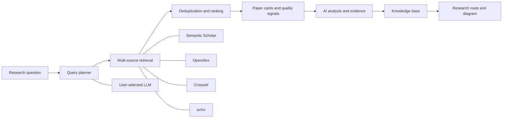

<p align="center">
  
</p>

<p align="center">
  <a href="https://github.com/zhangweiguo9719-web/ScholarNova/actions/workflows/ci.yml"></a>
  
  
  
  
  <a href="LICENSE"></a>
</p>

<p align="center">
  <strong>English</strong> · <a href="#中文说明">中文说明</a>
</p>

ScholarNova is a self-hosted academic discovery workspace for complex research questions. It turns a natural-language request into a query plan, retrieves papers from multiple scholarly indexes, ranks and explains the results, exposes evidence and quality signals, and organizes findings into a personal knowledge base.

The public edition is **BYOK (Bring Your Own Key)**: this repository contains no private API keys or licensed benchmark data. You choose the model provider, scholarly data sources, and deployment environment.

## Product preview

| Academic search workspace | Evidence-rich results |
| --- | --- |
|  |  |

| Research knowledge base | BYOK model configuration |
| --- | --- |
|  |  |

## What it does

- Understands and decomposes multi-constraint academic queries.
- Searches Semantic Scholar, OpenAlex, Crossref, and arXiv.
- Deduplicates and ranks papers using title, abstract, year, venue, citations, and query constraints.
- Displays abstracts, authors, metadata, relevance, citation percentile, citation velocity, and traceable quality signals.
- Produces AI summaries, contributions, limitations, methods, and evidence-oriented analysis.
- Saves discoveries into a knowledge base and generates research routes and framework diagrams.
- Supports English/Chinese UI, light/dark themes, rate limiting, retries, caching, and circuit breaking.
- Records API calls, end-to-end latency, and real LLM token usage when a model is invoked.

## Architecture



## Quick start with Docker Compose

Requirements: Git, Docker Engine 24+, Docker Compose v2, and at least 4 GB of free memory.

```bash
git clone https://github.com/zhangweiguo9719-web/ScholarNova.git
cd ScholarNova
cp .env.example .env
```

Windows PowerShell:

```powershell
git clone https://github.com/zhangweiguo9719-web/ScholarNova.git
Set-Location ScholarNova
Copy-Item .env.example .env
```

Edit `.env`. Configure at least one OpenAI-compatible LLM:

```dotenv
OPENAI_API_KEY=your-key
OPENAI_API_BASE=https://api.openai.com/v1
OPENAI_DEFAULT_MODEL=gpt-4o
DEFAULT_LLM_PROVIDER=openai
```

Recommended scholarly source configuration:

```dotenv
SEMANTIC_SCHOLAR_API_KEY=your-semantic-scholar-key
OPENALEX_EMAIL=you@example.com
CROSSREF_EMAIL=you@example.com
```

Optional SenseNova research-framework diagram provider:

```dotenv
SENSENOVA_API_KEY=your-sensenova-key
SENSENOVA_API_BASE=https://token.sensenova.cn/v1
SENSENOVA_DEFAULT_MODEL=sensenova-u1-fast
```

Before an internet-facing deployment, replace `POSTGRES_PASSWORD` and `SECRET_KEY` in `.env`.

```bash
docker compose up -d --build
```

Open:

- Web UI: <http://localhost:5173>
- Swagger API: <http://localhost:8000/docs>
- Health check: <http://localhost:8000/api/v1/health>

Operations:

```bash
docker compose ps
docker compose logs -f backend
docker compose down
```

## Local development without Docker

Local mode uses SQLite and an in-memory cache, so PostgreSQL and Redis are optional.

```bash
git clone https://github.com/zhangweiguo9719-web/ScholarNova.git
cd ScholarNova/backend
python -m venv .venv
```

Activate the environment and start the backend:

```bash
# Linux / macOS
source .venv/bin/activate

# Windows PowerShell
.\.venv\Scripts\Activate.ps1
```

```bash
python -m pip install --upgrade pip
pip install -e .
cp .env.example .env
uvicorn app.main:app --reload --host 127.0.0.1 --port 8000
```

On Windows, use `Copy-Item .env.example .env`. Edit `backend/.env` before starting. Database tables are created automatically on first startup.

In a second terminal:

```bash
cd ScholarNova/frontend
npm ci
npm run dev
```

Open <http://localhost:5173>.

## Provider configuration

| Purpose | Variable | Requirement |
| --- | --- | --- |
| Default LLM | `OPENAI_API_KEY` | Configure at least one LLM |
| Compatible endpoint | `OPENAI_API_BASE` | Required for compatible providers |
| Default model | `OPENAI_DEFAULT_MODEL` | Required |
| Semantic Scholar | `SEMANTIC_SCHOLAR_API_KEY` | Recommended; unauthenticated limits are stricter |
| OpenAlex polite pool | `OPENALEX_EMAIL` | Recommended |
| Crossref polite pool | `CROSSREF_EMAIL` | Recommended |
| SenseNova diagram | `SENSENOVA_API_KEY` | Optional |
| Gated benchmarks | `HF_ACCESS_TOKEN` / `HF_TOKEN` | Competition evaluation only |

Model configuration is also available in the Settings page. Server deployments should prefer `.env` so configuration survives container replacement.

## Public edition vs. competition environment

| Public GitHub edition | Local competition environment |
| --- | --- |
| Empty configuration templates | Private keys in ignored local `.env` files |
| Users provide their own API keys | Maintainer-selected model and data-source keys |
| No gated datasets in Git | Authorized PaSa/Asta data stored locally |
| Reproducible sample benchmark outputs | Full evaluation runs and private operational logs |
| Safe for forks and self-hosting | Optimized for the competition runtime and quotas |

The application code is shared. Credentials, licensed data, and private run artifacts are not.

## Evaluation snapshot

An 18-query deterministic subset of the official Asta Paper Finder validation set was used for targeted regression testing:

| Metric | Previous | Current |
| --- | ---: | ---: |
| Precision | 0.259434 | **0.352313** |
| Recall | 0.367893 | 0.331104 |
| F1 | 0.304288 | **0.341379** |
| Recall@20 | 0.160535 | **0.163880** |

This is a reproducible **18-query validation subset**, not a full competition score. It must not be directly compared with results reported on different datasets or evaluation protocols. Deterministic query planning intentionally consumes zero LLM tokens; model-assisted product queries report actual provider usage.

See [the benchmark report](outputs/competition-benchmark-report-2026-07-02.md), [the optimization report](outputs/optimization-report-2026-07-02.md), and the committed [prediction artifact](outputs/benchmarks/predictions/asta-s2-validation18-v3-2026-07-02.json).

## Verification

```bash
cd backend
pytest -m "not integration"

cd ../frontend
npm test
npm run build
```

## Security

- Never commit `.env`, API keys, model configuration files, gated datasets, or runtime logs.
- If a key has ever been exposed, revoke it at the provider and generate a replacement.
- JCR and CAS quartiles are shown only when backed by an authorized data source; ScholarNova does not fabricate them.
- Review [SECURITY.md](SECURITY.md) before a public deployment.

## Contributing

Issues and pull requests are welcome. Read [CONTRIBUTING.md](CONTRIBUTING.md) before submitting changes.

## 中文说明

ScholarNova 是一个可自行部署、由用户自行配置 API Key 的 AI 学术论文检索与研究工作台。它支持复杂查询理解与分解、多源检索、论文综合排序、质量信号、AI 深度分析、证据整理、个人知识库和研究路线生成。

公开仓库与比赛环境严格分离：公开版只提供空白配置模板和可复现样例，使用者填写自己的模型与学术数据源 Key；比赛使用的私有 Key、授权数据集和运行日志仅保存在本地并被 Git 忽略。

最省事的部署方式：

```powershell
git clone https://github.com/zhangweiguo9719-web/ScholarNova.git
Set-Location ScholarNova
Copy-Item .env.example .env
# 编辑 .env，填写自己的 Key
docker compose up -d --build
```

浏览器访问 <http://localhost:5173>。更多配置、验证和安全要求见上方英文文档。

## License

[MIT](LICENSE) © 2026 Zhang Weiguo.
