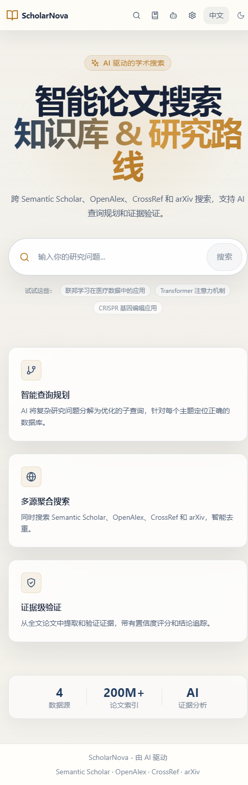
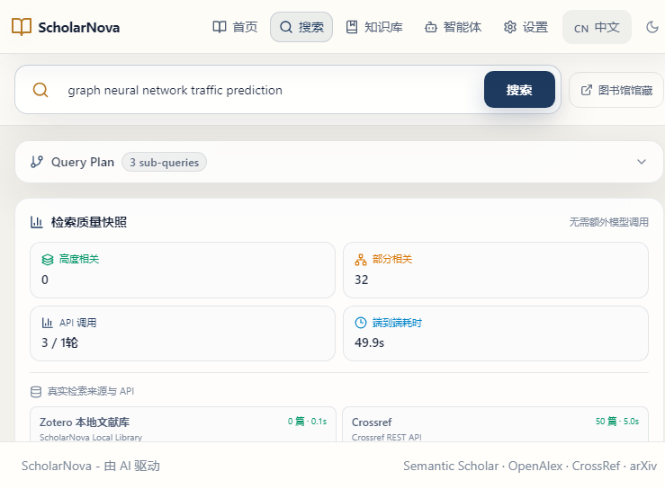
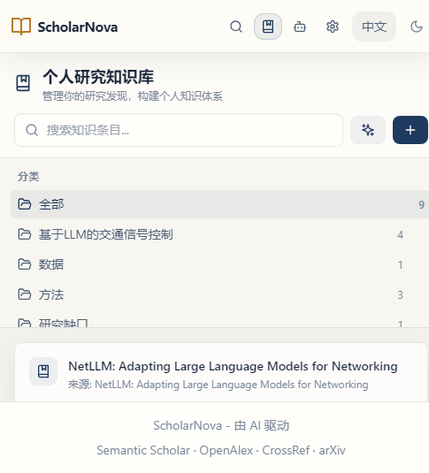
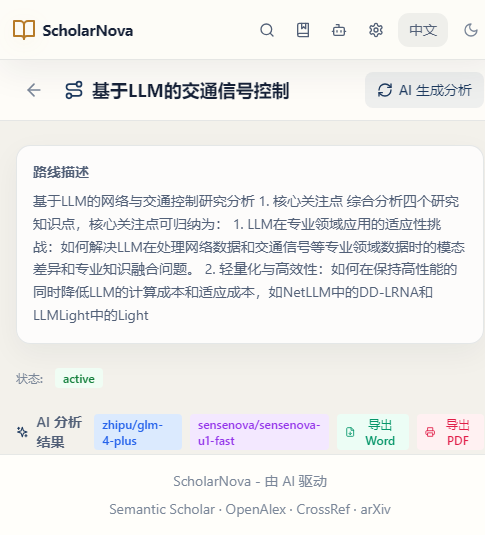
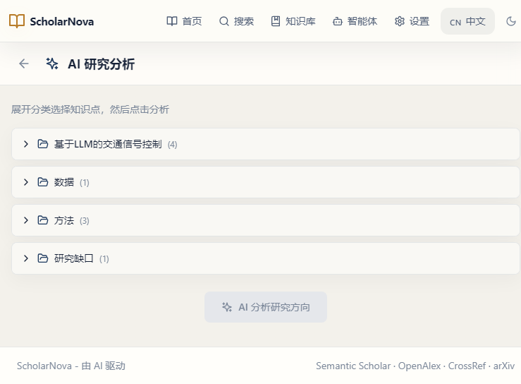
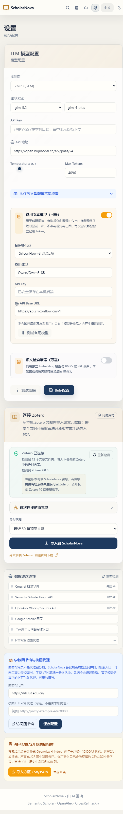
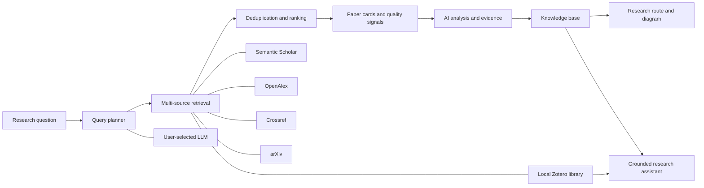

<p align="center">
  
</p>

<p align="center">
  <a href="https://github.com/zhangweiguo9719-web/ScholarNova/actions/workflows/ci.yml"></a>
  <a href="https://github.com/zhangweiguo9719-web/ScholarNova/releases/latest"></a>
  
  
  
  <a href="LICENSE"></a>
</p>

<p align="center">
  <strong>English</strong> · <a href="README.zh-CN.md">简体中文</a>
</p>

ScholarNova is a Windows and macOS desktop application and self-hostable academic discovery workspace for complex research questions. It turns a natural-language request into a query plan, retrieves papers from scholarly indexes and the user's own Zotero library, ranks and explains the results, exposes evidence and quality signals, and organizes findings into a personal knowledge base.

> Product architecture and rollout plan: [Client AI application roadmap (Simplified Chinese)](docs/AI_APPLICATION_ROADMAP.zh-CN.md).
>
> Engineering pipeline map: [ScholarNova FTI pipeline architecture (Simplified Chinese)](docs/FTI_PIPELINE_ARCHITECTURE.zh-CN.md).

The public edition is **BYOK (Bring Your Own Key)**: this repository contains no private API keys or licensed benchmark data. You choose the model provider, scholarly data sources, and deployment environment.

## Download ScholarNova (Windows & macOS)

**You do not need to install Python, Node.js, Docker, or a separate database.** The desktop edition contains the interface and the local backend service in one application, on both platforms.

### Current release: v1.2.0

**Windows**

- [Windows installer (`ScholarNova-Setup-1.2.0-x64.exe`)](https://github.com/zhangweiguo9719-web/ScholarNova/releases/latest)
- [Portable edition (`ScholarNova-Portable-1.2.0-x64.exe`)](https://github.com/zhangweiguo9719-web/ScholarNova/releases/latest)

**macOS** (Intel and Apple Silicon)

- [macOS disk image (`ScholarNova-1.2.0-x64.dmg` / `ScholarNova-1.2.0-arm64.dmg`)](https://github.com/zhangweiguo9719-web/ScholarNova/releases/latest)
- [macOS zip archives (`.zip`)](https://github.com/zhangweiguo9719-web/ScholarNova/releases/latest)
- [View all releases and release notes](https://github.com/zhangweiguo9719-web/ScholarNova/releases/latest)

On macOS, drag ScholarNova to the **Applications** folder after opening the `.dmg`. On first launch, macOS may ask you to confirm opening an app downloaded from the internet: right-click the app and choose **Open**, then **Open** again.

### Start in three steps

1. Download and run the installer (Windows) or the `.dmg` (macOS), or launch the portable `.exe` directly.
2. Open **Settings** and enter your own model and scholarly-data API keys, then press **Test connection** and **Save**.
3. Open **Search** to retrieve papers, run full-text AI analysis, save a knowledge base, and generate a research route.

Both editions create or update a ScholarNova desktop shortcut. The application automatically starts its bundled local service; there is no separate frontend or backend command to run.

- Desktop shell: Electron with an automatically started packaged FastAPI service. If the local service ever crashes, it restarts automatically.
- Local data: stored under the user's AppData (Windows) or Application Support (macOS) directory.
- Credentials: users configure their own API keys in the settings page; private keys are never bundled.
- Updates: download the newest installer or build from GitHub Releases.

Developers who want to build the application themselves can use the [Windows desktop release guide](docs/desktop-release.zh-CN.md). Source deployment instructions are provided later in this README.

## Product preview

| Academic search workspace | Live multi-source search |
| --- | --- |
|  |  |

| Research knowledge base | AI research route with diagram |
| --- | --- |
|  |  |

| AI research analysis | BYOK model configuration |
| --- | --- |
|  |  |

## Configure your own model API keys

ScholarNova never bundles provider keys. You bring your own. All configuration happens in **Settings → LLM model configuration**. Pick a provider, choose or type a model name, paste your API key, keep the default API address, press **Test connection**, then **Save**.

> The API key you type is stored only in the local backend on your own machine and never sent back to the browser or uploaded anywhere.

### Built-in providers

| Provider | Where to get an API key | API address (pre-filled) | Recommended models |
| --- | --- | --- | --- |
| **OpenAI** | [platform.openai.com](https://platform.openai.com) → API keys | `https://api.openai.com/v1` | `gpt-4o`, `gpt-4o-mini` |
| **ZhiPu (GLM)** | [open.bigmodel.cn](https://open.bigmodel.cn) → 个人中心 → API keys | `https://open.bigmodel.cn/api/paas/v4` | `glm-4-plus`, `glm-4.5-flash` |
| **SiliconFlow (硅基流动)** | [cloud.siliconflow.cn](https://cloud.siliconflow.cn) → API 密钥 | `https://api.siliconflow.cn/v1` | `Qwen/Qwen3-8B`, `Qwen/Qwen3-30B-A3B-Instruct-2507` |
| **SenseNova (商汤)** | [platform.sensenova.cn](https://platform.sensenova.cn) → 控制台 → API 密钥 | `https://token.sensenova.cn/v1` | `sensenova-u1-fast` (image), `sensenova-6.7-flash-lite` |
| **DeepSeek** | [platform.deepseek.com](https://platform.deepseek.com) → API keys | `https://api.deepseek.com/v1` | `deepseek-chat`, `deepseek-coder` |
| **Moonshot (Kimi)** | [platform.moonshot.cn](https://platform.moonshot.cn) → API keys | `https://api.moonshot.cn/v1` | `moonshot-v1-128k` |
| **Xiaomi MiMo** | MiMo token plan console | `https://token-plan-cn.xiaomimimo.com/v1` | `mimo-v2.5-pro` |
| **Alibaba Qwen** | [bailian.console.aliyun.com](https://bailian.console.aliyun.com) → API-KEY | `https://dashscope.aliyuncs.com/compatible-mode/v1` | `qwen-max`, `qwen-plus` |
| **Ollama (local)** | No key — install [Ollama](https://ollama.com) and pull a model | `http://localhost:11434` | `qwen2.5:14b`, `llama3:8b` |
| **Custom** | Any OpenAI-compatible endpoint | your own URL | your own model |

### Recommended setup (free / low-cost for students)

1. **Main model** — use **ZhiPu (GLM)**: register at [open.bigmodel.cn](https://open.bigmodel.cn), a new account usually receives free tokens. Choose `glm-4-plus` (text) as the main model.
2. **Vision / figure analysis** — still **ZhiPu**: for reading paper figures and tables, configure the **Vision** task model to a multimodal GLM such as `glm-4v-flash` or `glm-4.6v-flash` (see “Configure models by task” below).
3. **Fallback model** — enable **Fallback text model** and select **SiliconFlow** with `Qwen/Qwen3-8B`. It is tried only when the main model fails, so it never duplicates normal requests.
4. **Research diagrams** — enable the **Diagram** task model with **SenseNova** `sensenova-u1-fast` for research-framework figure generation. The nicer your prompt engineering, the better the figure.

### Configure models by task

Different jobs have different model needs. Open **Settings → 按任务类型配置不同模型** and assign a dedicated model per task:

| Task | Purpose | Suggested model |
| --- | --- | --- |
| 📊 论文分析 (analysis) | Deep paper analysis | GLM `glm-4-plus` |
| 🔍 查询规划 (query planning) | Natural-language → sub-queries | GLM `glm-4-plus` |
| 🌐 翻译 (translation) | Abstract translation | any text model |
| 👁️ 图表/架构分析 (vision) | Paper figures and tables | GLM `glm-4v-flash` |
| 📄 论文推荐 (recommendation) | Knowledge-grounded suggestions | GLM `glm-4-plus` |
| 🤖 科研问答智能体 (assistant) | Traceable RAG answers | GLM `glm-4-plus` |
| 🎨 图表生成 (diagram) | Research architecture images | SenseNova `sensenova-u1-fast` |

Each task row also shows a capability badge (text / vision / image / JSON) and a **真实测试此任务** button that sends one real request to confirm the model actually works for that task before you rely on it.

### Optional: semantic retrieval (embedding)

Open **Settings → Semantic retrieval** to combine an independent embedding model with BM25 for better recall. No configuration is needed for basic use — ScholarNova falls back to BM25 automatically.

## What it does

- Understands and decomposes multi-constraint academic queries.
- Searches Semantic Scholar, OpenAlex, Crossref, and arXiv.
- Governs all Semantic Scholar search, health, and PDF-resolution calls through one cross-process cadence and shared 429 cooldown; recent successful health is reused without spending another request.
- Connects to the local Zotero library and searches explicitly imported metadata alongside online sources.
- Can write papers you approve back into your local Zotero library through Zotero's local Connector API (same mechanism as the browser plugin), letting you choose the target collection.
- Includes a traceable research assistant with zero-cost multilingual BM25 by default and optional BM25 + embedding + RRF hybrid retrieval across knowledge chunks, parsed PDFs, and live local Zotero records.
- Shows task-aware model capability hints for text, structured output, vision, image generation, and embeddings without making a paid provider call; unknown custom models are labelled for testing rather than falsely claimed as compatible.
- Preserves section and page locators when available and shows localized evidence locations on assistant citation cards.
- Deduplicates and ranks papers using title, abstract, year, venue, citations, and query constraints.
- Displays abstracts, authors, metadata, relevance, citation percentile, citation velocity, and traceable quality signals.
- Shows live elapsed time, exact source API/query/call status, and supports an intentional re-run of the same query.
- Resolves legal open-access PDFs through direct links, arXiv, OpenAlex, Unpaywall, Semantic Scholar, Crossref, and PMC. When a publisher blocks automated access, users can import an authorized local PDF for persistent full-text, table, caption, and visual-page analysis.
- Clearly distinguishes full-text analysis from abstract-only fallback and shows the exact retrieval status instead of implying that unavailable source material was read.
- Figure pages are sent through the task-specific vision profile. Configure a multimodal model under **Settings → Task models → Vision**; if it rejects image input, ScholarNova transparently falls back to parsed full text, tables, and captions and reports that no page images were read.
- Completed paper analyses show provider-reported total Token usage, with prompt and completion counts also available in the API response.
- Each task model now has an opt-in real capability probe in Settings. Structured tasks must return parseable JSON, vision tasks must identify an embedded test image, and image generation requires an explicit cost confirmation. The latest latency and provider-reported input/output/total Token counts stay on the local machine; opening or saving configuration never triggers a model call.
- Provides a keyboard-accessible, drag-resizable paper detail panel and remembers its width.
- Produces AI summaries, contributions, limitations, methods, and evidence-oriented analysis; analysis is temporarily retained per paper within the current search run.
- Treats search as page-scoped state: leaving Search clears the query, results, selection, and temporary analyses, while server-side response caching can still protect scholarly API quotas.
- Enriches visible results with clearly labelled OpenAlex journal metrics and accepts user-authorized JCR, historical CAS, or SJR CSV/JSON imports without guessing commercial quartiles.
- Opens an institutional library handoff with the query copied; institutional authentication is still required and is never bypassed.
- Saves discoveries into a knowledge base and generates research routes and framework diagrams.
- Supports English/Chinese UI, light/dark themes, rate limiting, retries, caching, and circuit breaking.
- Records API calls, end-to-end latency, and real LLM token usage when a model is invoked.

### Local Zotero connection

1. Start Zotero, open **Zotero Settings → Advanced**, and enable **Allow other applications on this computer to communicate with Zotero**.
2. Open **ScholarNova Settings → Connect Zotero** and confirm that the connection is detected.
3. Select a Zotero collection, or the 50 most recent top-level items, and choose **Import to ScholarNova**.
4. Normal ScholarNova searches will also query the imported local metadata without making an extra network request.
5. To push a paper back into Zotero, open a paper detail and use **Sync to Zotero**, then choose the target collection. ScholarNova uses Zotero's local Connector endpoint — the same one the Zotero browser plugin uses — so it works on Zotero 9 as well.

ScholarNova does not read `zotero.sqlite` directly and it never uploads an entire library. Imports are idempotent by Zotero Item Key and DOI. Attachment PDFs are not copied automatically; use a lawful open copy or upload a PDF you are authorized to use when full text is required.

ScholarNova displays the detected Zotero version and whether local access is read-only or read-write.

### Traceable research assistant

Open **Assistant** to create research folders and isolated conversations over user-controlled ScholarNova knowledge, parsed authorized PDFs, and the live local Zotero library. Deleting a folder safely moves its conversations to **Unfiled**. Local conversation counts are bounded to prevent unlimited browser storage growth. BM25 remains the default and makes no model call. To add semantic recall, open **Settings → Semantic retrieval**, explicitly configure a separate embedding profile, test it, and save. Supported profiles include local Ollama (`nomic-embed-text`), OpenAI (`text-embedding-3-small`), Zhipu (`embedding-3`), Qwen (`text-embedding-v4`), and custom OpenAI-compatible endpoints.

The hybrid path embeds up to 256 source-balanced candidates, fuses vector and BM25 ranks with RRF, and caches vectors locally by provider, model, and content hash. Repeated material does not consume embedding tokens again. A timeout, rate limit, invalid profile, or offline embedding service falls back to BM25 without blocking the answer. Embedding credentials are independent from chat credentials and are never returned to the browser. The trace reports the retrieval mode, embedding tokens, chat tokens, cited records, and page-aware source locations. If no local material is found, the answer model is not called. Conversation history remains local and the assistant never writes to Zotero automatically.

After generation, a zero-token deterministic verifier reports factual-segment citation coverage, unknown source IDs, and uncited segments as verified, partial, or failed. This is an integrity check, not a claim of semantic entailment. If the answer model is offline or times out, ScholarNova returns a bounded list of retrieved evidence with valid `[S1]` markers instead of failing the whole request, and labels the response as a deterministic evidence fallback.

An optional fallback can be configured under **Settings → Fallback text model**—for example, Zhipu or MiMo as primary and Alibaba Qwen or SiliconFlow as fallback. Research Q&A, AI query planning, title/abstract translation, paper text analysis, knowledge polishing, research-direction analysis, route text generation, and recommendation planning now use this shared route. Normal requests call only the primary model; fallback is tried once only after bounded primary retries fail. PDF page images remain exclusive to the vision task, while SenseNova or another diagram model remains an isolated image-generation route. Paper and knowledge analysis report the selected model, fallback state, and provider-reported Token usage. If both text routes fail, ScholarNova returns an evidence-bounded deterministic result; recommendation planning produces verifiable search directions rather than inventing paper titles or DOIs when no academic-API metadata is available. Credentials and endpoints remain isolated by provider.

### Journal data and institutional access

Open **Settings → Journal quartiles** to import a CSV or JSON file that you are licensed to use. A minimal CSV is:

```csv
Journal,JCR Quartile,中科院分区,SJR Best Quartile,Year,Source
Nature Communications,Q1,1区,Q1,2025,my authorized dataset
```

Unknown values stay unknown. OpenAlex H-index, two-year mean citedness, and DOAJ status are labelled as open indicators and are not presented as JCR/CAS quartiles. The library button copies the active query and opens the configured portal; campus network, institutional VPN, or single sign-on is still required for subscribed resources.

## Architecture


```mermaid
flowchart LR
    U["Research question"] --> Q["Query planner"]
    Q --> S["Multi-source retrieval"]
    S --> D["Deduplication and ranking"]
    D --> R["Paper cards and quality signals"]
    R --> A["AI analysis and evidence"]
    A --> K["Knowledge base"]
    K --> G["Research route and diagram"]
    K --> RA["Grounded research assistant"]
    Z --> RA

    S --- SS["Semantic Scholar"]
    S --- OA["OpenAlex"]
    S --- CR["Crossref"]
    S --- AX["arXiv"]
    S --- Z["Local Zotero library"]
    Q --- LLM["User-selected LLM"]
```

### Application stack

| Layer | Technology and responsibility |
| --- | --- |
| Desktop | Electron, electron-builder, and PyInstaller for a self-contained Windows and macOS application |
| Frontend | React 18, TypeScript, Vite, Zustand, React Router, Axios, and Mermaid |
| Backend | Python, FastAPI, Pydantic, AsyncIO, and Uvicorn |
| Data | SQLAlchemy, local SQLite, server PostgreSQL, and Redis/in-memory caching |
| Retrieval | Semantic Scholar, OpenAlex, Crossref, arXiv, and Zotero Local API; query planning, concurrent recall, deduplication, constraints, and MMR ranking |
| Documents and AI | PyMuPDF full-text/figure parsing and task-routed OpenAI-compatible, Anthropic, Ollama, MiMo, SiliconFlow Qwen, and SenseNova models |
| Engineering | pytest, Vitest, Ruff, and GitHub Actions (Windows + macOS release pipeline) |

## Source deployment with Docker Compose (advanced)

Requirements: Git, Docker Engine 24+, Docker Compose v2, and at least 4 GB of free memory.

```bash
git clone https://github.com/zhangweiguo9719-web/ScholarNova.git
cd ScholarNova
cp .env.example .env
```

Windows PowerShell:

```powershell
git clone https://github.com/zhangweiguo9719-web/ScholarNova.git
Set-Location ScholarNova
Copy-Item .env.example .env
```

Edit `.env`. Configure at least one OpenAI-compatible LLM:

```dotenv
OPENAI_API_KEY=your-key
OPENAI_API_BASE=https://api.openai.com/v1
OPENAI_DEFAULT_MODEL=gpt-4o
DEFAULT_LLM_PROVIDER=openai
```

Recommended scholarly source configuration:

```dotenv
SEMANTIC_SCHOLAR_API_KEY=your-semantic-scholar-key
OPENALEX_API_KEY=your-openalex-key
OPENALEX_EMAIL=you@example.com
CROSSREF_EMAIL=you@example.com
```

Optional SenseNova research-framework diagram provider:

```dotenv
SENSENOVA_API_KEY=your-sensenova-key
SENSENOVA_API_BASE=https://token.sensenova.cn/v1
SENSENOVA_DEFAULT_MODEL=sensenova-u1-fast
```

Before an internet-facing deployment, replace `POSTGRES_PASSWORD` and `SECRET_KEY` in `.env`.

```bash
docker compose up -d --build
```

Open:

- Web UI: <http://localhost:5173>
- Swagger API: <http://localhost:8000/docs>
- Health check: <http://localhost:8000/api/v1/health>

Operations:

```bash
docker compose ps
docker compose logs -f backend
docker compose down
```

## Source development without Docker (advanced)

Local mode uses SQLite and an in-memory cache, so PostgreSQL and Redis are optional.

```bash
git clone https://github.com/zhangweiguo9719-web/ScholarNova.git
cd ScholarNova/backend
python -m venv .venv
```

Activate the environment and start the backend:

```bash
# Linux / macOS
source .venv/bin/activate

# Windows PowerShell
.\.venv\Scripts\Activate.ps1
```

```bash
python -m pip install --upgrade pip
pip install -e .
cp .env.example .env
uvicorn app.main:app --reload --host 127.0.0.1 --port 8000
```

On Windows, use `Copy-Item .env.example .env`. Edit `backend/.env` before starting. Database tables are created automatically on first startup.

In a second terminal:

```bash
cd ScholarNova/frontend
npm ci
npm run dev
```

Open <http://localhost:5173>.

## Provider configuration

| Purpose | Variable | Requirement |
| --- | --- | --- |
| Default LLM | `OPENAI_API_KEY` | Configure at least one LLM |
| Compatible endpoint | `OPENAI_API_BASE` | Required for compatible providers |
| Default model | `OPENAI_DEFAULT_MODEL` | Required |
| Semantic Scholar | `SEMANTIC_SCHOLAR_API_KEY` | Recommended; unauthenticated limits are stricter |
| OpenAlex API | `OPENALEX_API_KEY` | Recommended |
| OpenAlex polite pool | `OPENALEX_EMAIL` | Recommended |
| Crossref polite pool | `CROSSREF_EMAIL` | Recommended |
| SenseNova diagram | `SENSENOVA_API_KEY` | Optional |

Model configuration is also available in the Settings page. Server deployments should prefer `.env` so configuration survives container replacement.

For official registration links and provider-specific configuration, read the
[API key application guide](docs/API_KEYS.md).

## Evaluation snapshot

An 18-query deterministic subset of the official Asta Paper Finder validation set was used for targeted regression testing:

| Metric | Previous | Current |
| --- | ---: | ---: |
| Precision | 0.259434 | **0.352313** |
| Recall | 0.367893 | 0.331104 |
| F1 | 0.304288 | **0.341379** |
| Recall@20 | 0.160535 | **0.163880** |

This is a reproducible **18-query validation subset**, not a full competition score. It must not be directly compared with results reported on different datasets or evaluation protocols. Deterministic query planning intentionally consumes zero LLM tokens; model-assisted product queries report actual provider usage.

The complete 66-query file has also been executed. Of those queries, 27 expose
binary paper-ID gold labels and score F1=`0.283713`; the remaining 39 require a
textual relevance judge and are reported separately instead of being forced
into the binary metric.

See [the benchmark report](outputs/competition-benchmark-report-2026-07-02.md), [the v1.1.0 optimization report](docs/reports/v1.1.0-optimization-test-report.zh-CN.md), [the v1.1.1 full-text, vision, and desktop test report](docs/reports/v1.1.1-fulltext-vision-desktop-report.zh-CN.md), [the FTI-4 session and rate-governance report](docs/reports/fti-4-session-and-rate-governance.zh-CN.md), and the committed [prediction artifact](outputs/benchmarks/predictions/asta-s2-validation18-v3-2026-07-02.json).

## Verification

```bash
cd backend
pytest -m "not integration"

cd ../frontend
npm test
npm run build
```

## Security

- Never commit `.env`, API keys, model configuration files, gated datasets, or runtime logs.
- If a key has ever been exposed, revoke it at the provider and generate a replacement.
- JCR and CAS quartiles are shown only when backed by an authorized data source; ScholarNova does not fabricate them.
- Review [SECURITY.md](SECURITY.md) before a public deployment.

## Contributing

Issues and pull requests are welcome. Read [CONTRIBUTING.md](CONTRIBUTING.md) before submitting changes.

## License

[MIT](LICENSE) © 2026 Zhang Weiguo.
