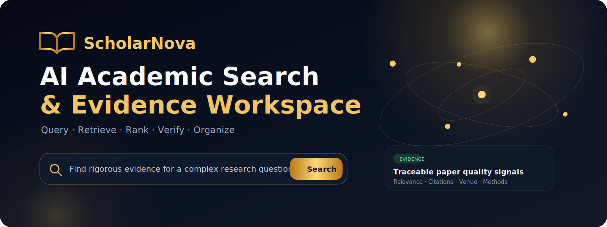
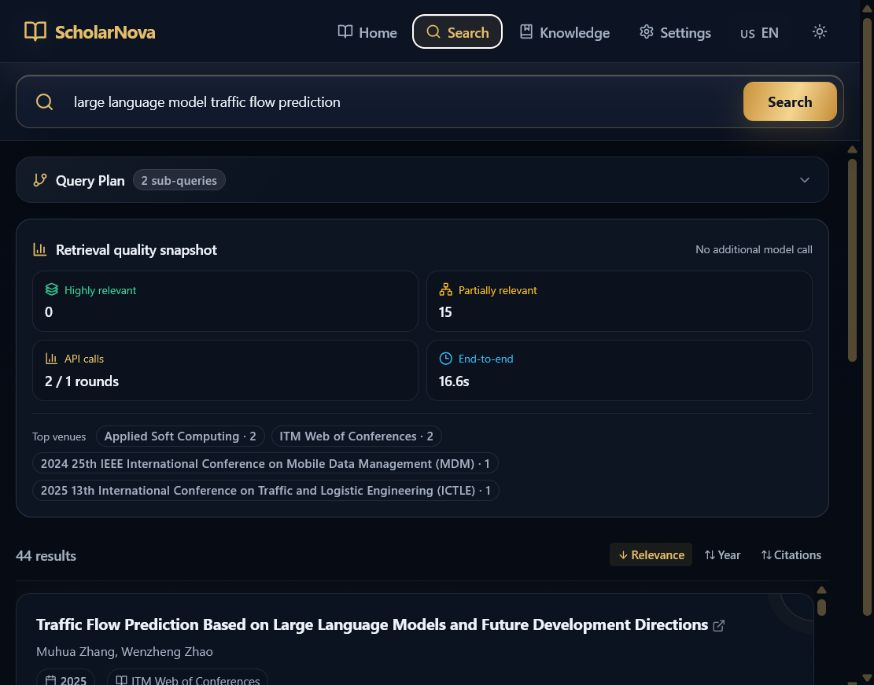
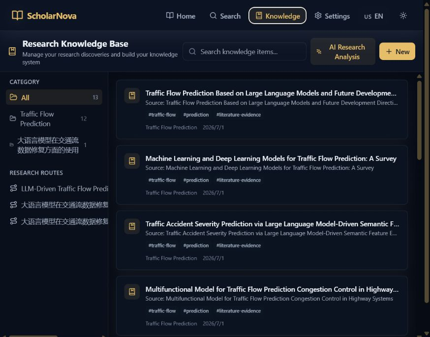
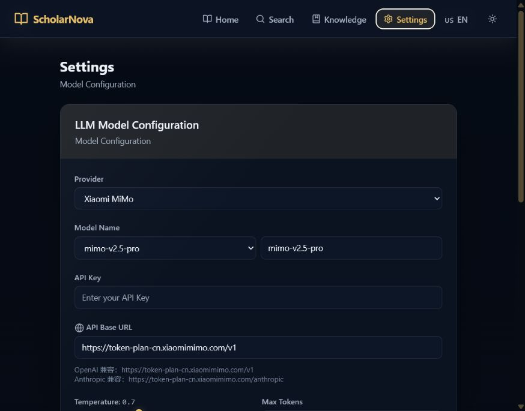
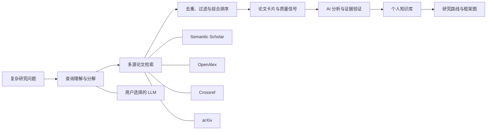

<p align="center">
  
</p>

<p align="center">
  <a href="README.md">English</a> · <strong>简体中文</strong>
</p>

<p align="center">
  <a href="https://github.com/zhangweiguo9719-web/ScholarNova/releases/latest"></a>
</p>

# ScholarNova：AI 学术论文检索与研究工作台

ScholarNova 面向复杂科研问题，将自然语言查询转化为检索计划，连接多个学术数据源，对论文进行去重、排序、质量分析和证据整理，并将研究发现沉淀到个人知识库与研究路线中。

公开版采用 **BYOK（Bring Your Own Key）**：仓库不提供、不收集任何私人 API Key，也不包含授权评测数据。使用者可以自行选择模型、学术数据源和部署环境。

## Windows 桌面版（推荐普通用户）

无需手动安装 Python、Node.js、数据库，也不需要分别启动前后端：

1. 打开 [GitHub Releases 下载页](https://github.com/zhangweiguo9719-web/ScholarNova/releases/latest)。
2. 下载 `ScholarNova-Setup-1.1.0-x64.exe` 并安装；不想安装可下载 `ScholarNova-Portable-1.1.0-x64.exe`。安装版与便携版都会创建或更新 ScholarNova 桌面快捷方式。
3. 启动 ScholarNova，在“设置”中填写自己的模型和学术数据源 API Key。
4. 进入搜索页开始论文检索、AI 分析、知识库保存与研究路线生成。

桌面版会自动启动内置服务，数据与配置保存在当前 Windows 用户的 AppData 中。安装包不包含维护者的 API Key、授权数据集或本地数据库。详细说明见 [Windows 桌面版发布指南](docs/desktop-release.zh-CN.md)。

## 产品界面

| 学术检索首页 | 结构化检索结果 |
| --- | --- |
|  |  |

| 个人研究知识库 | BYOK 模型配置 |
| --- | --- |
|  |  |

## 主要能力

- 复杂学术查询理解、约束识别、子查询分解与有界迭代检索。
- Semantic Scholar、OpenAlex、Crossref、arXiv 多源搜索。
- 标题、摘要、年份、venue、引用量和查询约束综合排序。
- 完整论文卡片：标题、作者、摘要、年份、来源、引用量、相关度和质量信号。
- 实时显示检索耗时、实际调用的 API、检索式、单源篇数与耗时；允许主动重复执行相同关键词。
- AI 分析按需获取合法开放 PDF，解析正文、章节、表格与图注；视觉模型可同时读取包含图表的 PDF 页面图像。
- 同一次检索中按论文临时保存 AI 分析，切换论文不会丢失，开始新检索时才清空。
- 引用百分位、年均引用、OpenAlex H-index/两年篇均被引/DOAJ；可导入自己有权使用的 JCR、历史中科院或 SJR CSV/JSON，系统不会伪造分区。
- 学校图书馆采用“复制检索词 + 打开门户”的合规衔接，仍需校园网、学校 VPN 或统一身份认证，不绕过订阅授权。
- 个人研究知识库、主题分类、研究路线与 SenseNova U1 框架图。
- 中英文切换、明暗主题、缓存、重试、限流和熔断。
- API 调用次数、端到端延时与真实 LLM Token 计量。

### 分区数据与学校图书馆

在“设置 → 期刊分区与开放质量指标”中可导入自己有权使用的 CSV/JSON。最简 CSV 示例：

```csv
Journal,JCR Quartile,中科院分区,SJR Best Quartile,Year,Source
Nature Communications,Q1,1区,Q1,2025,本人有权使用的数据
```

没有数据就保持未知，不推测分区。OpenAlex H-index、两年篇均被引和 DOAJ 会明确标成开放指标，不作为 JCR/中科院分区。检索页“图书馆馆藏”会复制当前检索词并打开配置的门户；订阅资源仍需校园网、学校 VPN 或统一身份认证。

## 系统架构



## Docker 一键部署

环境要求：

- Git
- Docker Engine 24+
- Docker Compose v2
- 至少 4 GB 可用内存

```powershell
git clone https://github.com/zhangweiguo9719-web/ScholarNova.git
Set-Location ScholarNova
Copy-Item .env.example .env
```

编辑根目录 `.env`，至少配置一个兼容 OpenAI 协议的模型：

```dotenv
OPENAI_API_KEY=填写自己的模型密钥
OPENAI_API_BASE=https://api.openai.com/v1
OPENAI_DEFAULT_MODEL=gpt-4o
DEFAULT_LLM_PROVIDER=openai
```

推荐配置学术数据源：

```dotenv
SEMANTIC_SCHOLAR_API_KEY=填写自己的SemanticScholar密钥
OPENALEX_API_KEY=填写自己的OpenAlex密钥
OPENALEX_EMAIL=you@example.com
CROSSREF_EMAIL=you@example.com
```

可选的 SenseNova 框架图配置：

```dotenv
SENSENOVA_API_KEY=填写自己的SenseNova密钥
SENSENOVA_API_BASE=https://token.sensenova.cn/v1
SENSENOVA_DEFAULT_MODEL=sensenova-u1-fast
```

启动：

```powershell
docker compose up -d --build
```

访问：

- 产品页面：<http://localhost:5173>
- Swagger API：<http://localhost:8000/docs>
- 健康检查：<http://localhost:8000/api/v1/health>

查看状态和日志：

```powershell
docker compose ps
docker compose logs -f backend
```

停止服务：

```powershell
docker compose down
```

## 不使用 Docker 的本地运行

本地模式默认使用 SQLite 与内存缓存，不强制安装 PostgreSQL 和 Redis。

```powershell
git clone https://github.com/zhangweiguo9719-web/ScholarNova.git
Set-Location ScholarNova\backend
python -m venv .venv
.\.venv\Scripts\Activate.ps1
python -m pip install --upgrade pip
pip install -e .
Copy-Item .env.example .env
```

编辑 `backend/.env` 后启动：

```powershell
uvicorn app.main:app --reload --host 127.0.0.1 --port 8000
```

另开一个终端：

```powershell
Set-Location ScholarNova\frontend
npm ci
npm run dev
```

## API Key 去哪里申请

项目支持 OpenAI、Anthropic、小米 MiMo、DeepSeek、智谱 GLM、阿里云百炼 Qwen、Moonshot Kimi、SenseNova 和自定义 OpenAI 兼容服务。

学术检索支持 Semantic Scholar、OpenAlex、Crossref 和 arXiv。

每个平台的官方申请入口、Base URL、环境变量和注意事项见：

**[API Key 申请与配置指南](docs/API_KEYS.md)**

不要从不明第三方购买或共享 Key。不同平台的订阅会员通常不等于 API 额度，具体以平台控制台为准。

## 公开版与比赛环境的边界

| GitHub 公开版 | 本地比赛环境 |
| --- | --- |
| 只提供空白配置模板 | 私有 Key 保存在被忽略的 `.env` |
| 用户自行申请和填写 API Key | 使用参赛者自己的模型与数据源账号 |
| 不包含授权数据集 | PaSa/Asta 授权数据仅存本地 |
| 提供可复现样例结果 | 保存完整评测运行和私有日志 |
| 适合 Fork、自行部署 | 针对比赛限额与运行环境优化 |

两者共享产品代码，但不共享凭据、授权数据和私有运行产物。

## 当前测试说明

已公开的指标来自 Asta Paper Finder 官方验证集中的 18 条确定性回归子集：

| 指标 | 上一版 | 当前 |
| --- | ---: | ---: |
| Precision | 0.259434 | **0.352313** |
| Recall | 0.367893 | 0.331104 |
| F1 | 0.304288 | **0.341379** |
| Recall@20 | 0.160535 | **0.163880** |

这不是完整比赛总分，也不能与不同数据集、不同评测协议的论文结果直接等同。完整 66 条验证集复测正在用于后续改进。

目前已完成全部 66 条执行。其中 27 条带有可直接计算二值 F1 的论文 ID，F1=`0.283713`；另外 39 条只有文字相关性准则，需要官方或模型裁判，因此单独报告，不强行塞进二值 F1。

- [比赛指标报告](outputs/competition-benchmark-report-2026-07-02.md)
- [本次优化报告](outputs/optimization-report-2026-07-02.md)
- [三分钟中文演示稿](docs/demo/three-minute-product-video-script.md)

## 测试

```powershell
Set-Location backend
pytest -m "not integration"

Set-Location ..\frontend
npm test
npm run build
```

真实外部 API 集成测试需要网络、API Key 和对应限额，因此不放进每次公开 CI。

## 安全要求

- 不要提交 `.env`、API Key、本地模型配置、授权数据集、数据库或运行日志。
- 如果 Key 曾出现在聊天、截图、Issue 或 Git 历史中，应立即在对应平台撤销并重新生成。
- 公网部署前必须修改数据库密码和应用 `SECRET_KEY`。
- 只在获得合法授权数据后显示 JCR、中科院分区等商业指标。
- 更多要求见 [SECURITY.md](SECURITY.md)。

## 参与贡献

欢迎提交 Issue 与 Pull Request。提交前请阅读 [CONTRIBUTING.md](CONTRIBUTING.md)。

## 许可证

[MIT](LICENSE) © 2026 Zhang Weiguo。
