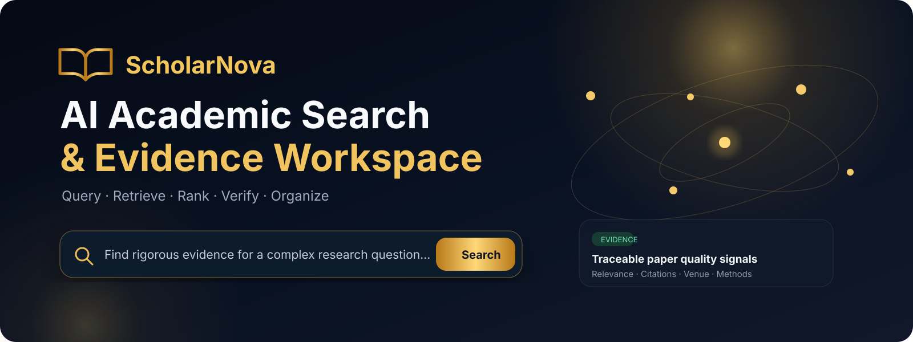
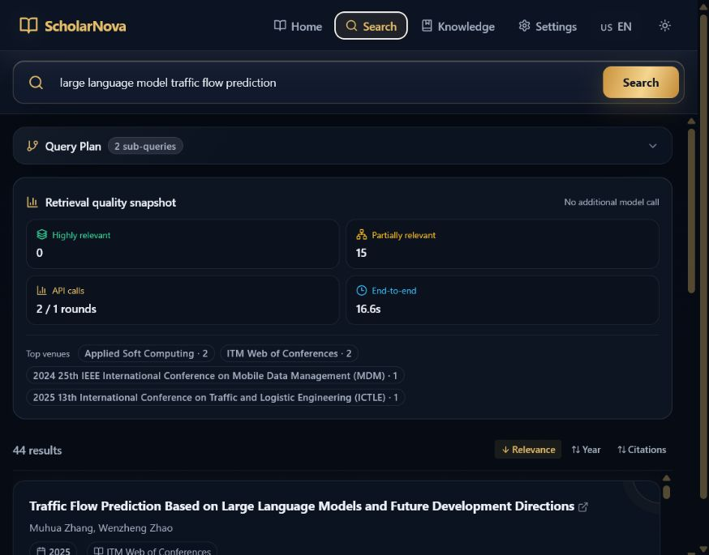
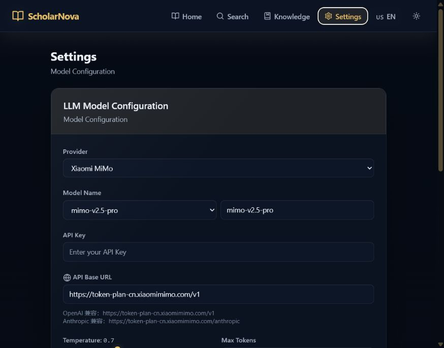
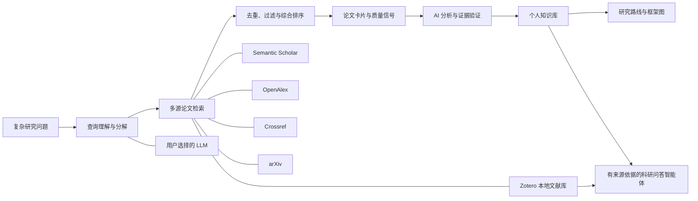

<p align="center">
  
</p>

<p align="center">
  <a href="README.md">English</a> · <strong>简体中文</strong>
</p>

<p align="center">
  <a href="https://github.com/zhangweiguo9719-web/ScholarNova/releases/latest"></a>
</p>

# ScholarNova：AI 学术论文检索与研究工作台

> 面向客户端的后续建设方案见：[AI 应用开发路线图](docs/AI_APPLICATION_ROADMAP.zh-CN.md)。文档说明模型替换、检索加速、长文 RAG、网络兜底、授权馆藏、文献管理器泛化与 MCP 的实施边界。
>
> 面向工程落地的流水线拆分见：[ScholarNova FTI 流水线架构](docs/FTI_PIPELINE_ARCHITECTURE.zh-CN.md)。

ScholarNova 面向复杂科研问题，将自然语言查询转化为检索计划，连接多个学术数据源和用户自己的 Zotero 文献库，对论文进行去重、排序、质量分析和证据整理，并将研究发现沉淀到个人知识库与研究路线中。

公开版采用 **BYOK（Bring Your Own Key）**：仓库不提供、不收集任何私人 API Key，也不包含授权评测数据。使用者可以自行选择模型、学术数据源和部署环境。

## Windows 桌面版（推荐普通用户）

无需手动安装 Python、Node.js、数据库，也不需要分别启动前后端：

### 直接下载 v1.1.1

- [Windows 安装版：`ScholarNova-Setup-1.1.1-x64.exe`](https://github.com/zhangweiguo9719-web/ScholarNova/releases/download/v1.1.1/ScholarNova-Setup-1.1.1-x64.exe)
- [Windows 绿色版：`ScholarNova-Portable-1.1.1-x64.exe`](https://github.com/zhangweiguo9719-web/ScholarNova/releases/download/v1.1.1/ScholarNova-Portable-1.1.1-x64.exe)
- [全部版本与更新说明](https://github.com/zhangweiguo9719-web/ScholarNova/releases/latest)

### 三步开始使用

1. 下载并安装 Windows 安装版，或者直接运行绿色版 `.exe`。
2. 启动 ScholarNova，在“设置”中填写自己的模型和学术数据源 API Key。
3. 进入“搜索”页开始论文检索、全文 AI 分析、知识库保存与研究路线生成。

安装版与绿色版都会创建或更新 ScholarNova 桌面快捷方式。桌面版会自动启动内置服务，不需要再运行前端或后端命令；数据与配置保存在当前 Windows 用户的 AppData 中。安装包不包含维护者的 API Key、授权数据集或本地数据库。开发者自行构建说明见 [Windows 桌面版发布指南](docs/desktop-release.zh-CN.md)。

## 产品界面

| 学术检索首页 | 结构化检索结果 |
| --- | --- |
|  |  |

| 个人研究知识库 | BYOK 模型配置 |
| --- | --- |
|  |  |

## 主要能力

- 复杂学术查询理解、约束识别、子查询分解与有界迭代检索。
- Semantic Scholar、OpenAlex、Crossref、arXiv 多源搜索。
- 通过 Zotero Local API 只读连接本机文献库，显式导入后可与在线学术源一起检索。
- 提供可追溯科研问答智能体：默认用零额外成本的中英文 BM25 排序知识库、已解析 PDF 与本机 Zotero；用户也可单独配置 Embedding 模型，启用 BM25 + 向量语义 + RRF 混合检索。
- 设置页会按任务检查已知模型能力，区分文本、结构化输出、视觉理解、图像生成和 Embedding；该检查不调用付费模型，无法识别的自定义模型会提示先测试，不会被误判为已支持。
- 标题、摘要、年份、venue、引用量和查询约束综合排序。
- 完整论文卡片：标题、作者、摘要、年份、来源、引用量、相关度和质量信号。
- 实时显示检索耗时、实际调用的 API、检索式、单源篇数与耗时；允许主动重复执行相同关键词。
- AI 分析会通过直链、arXiv、OpenAlex、Unpaywall、Semantic Scholar、Crossref 与 PMC 获取合法开放 PDF；若出版社阻止程序下载，可导入用户有权使用的本地 PDF，持久解析正文、章节、表格、图注及图表页面。
- 页面会明确区分“已读取全文”和“仅摘要”，并展示自动获取失败原因；不会把未取得的正文伪装成已读取。
- 图表页优先使用“设置 → 按任务配置不同模型 → 视觉”中的多模态模型；若该模型拒绝图片输入，系统会透明回退到正文、表格与图注，并如实显示未读取页面图像。
- 论文分析完成后会展示模型供应商返回的总 Token，用于竞赛成本记录；API 响应同时提供输入和输出 Token。
- 论文详情侧栏支持向左拖动扩宽、键盘方向键调整，并记住上次宽度。
- 同一次检索中按论文临时保存 AI 分析，切换论文不会丢失，开始新检索时才清空。
- 引用百分位、年均引用、OpenAlex H-index/两年篇均被引/DOAJ；可导入自己有权使用的 JCR、历史中科院或 SJR CSV/JSON，系统不会伪造分区。
- 学校图书馆采用“复制检索词 + 打开门户”的合规衔接，仍需校园网、学校 VPN 或统一身份认证，不绕过订阅授权。
- 个人研究知识库、主题分类、研究路线与 SenseNova U1 框架图。
- 中英文切换、明暗主题、缓存、重试、限流和熔断。
- API 调用次数、端到端延时与真实 LLM Token 计量。

### Zotero 本地连接（`main` 源码版）

1. 启动 Zotero，打开“设置 → 高级”，勾选“允许此计算机上的其他应用程序与 Zotero 通讯”。
2. 打开 ScholarNova 的“设置 → 连接 Zotero”，确认状态显示为“已连接”。
3. 选择一个 Zotero 文件夹或最近 50 篇顶层文献，点击“导入到 ScholarNova”。
4. 后续普通搜索会同时检索已导入的 Zotero 元数据，不产生额外网络请求。

当前接入严格只读：ScholarNova 不修改 Zotero、不直接访问 `zotero.sqlite`，也不会上传整个文献库。导入会使用 Zotero Item Key 和 DOI 避免重复；附件 PDF 暂不自动复制，需要全文时可获取合法开放版本，或由用户手动导入自己有权使用的 PDF。

ScholarNova 会显示检测到的 Zotero 版本。Zotero 9 已可支持当前只读流程；将检索结果直接写回 Zotero 需要 Zotero 10 或更高版本，本次智能体雏形尚未开启自动写入。

> 该功能当前位于 `main` 源码分支，将随下一个 Windows 版本发布；上方 v1.1.1 安装包尚不包含此功能。

### 可追溯科研问答智能体（`main` 源码版）

进入“智能体”页面后，可以选择使用 ScholarNova 本地材料和实时本机 Zotero。导入或分析过的授权 PDF 会把摘要、章节、表格和图注保存为版本化检索片段，并尽可能保留章节与页码。默认模式使用不消耗模型 Token 的中英文 BM25；在“设置 → 语义检索增强”中明确启用独立 Embedding 模型后，系统会对最多 256 个均衡候选执行向量排序，再通过 RRF 与 BM25 融合。向量按提供商、模型和内容哈希缓存在本机数据库，重复材料不会再次计费；Embedding 超时、限流、配置错误或服务离线时会自动退回 BM25，不影响基础问答。

本机优先方案是 Ollama + `nomic-embed-text`，无需云端 Key；也可以配置 OpenAI `text-embedding-3-small`、智谱 `embedding-3`、阿里云百炼 `text-embedding-v4` 或其他 OpenAI 兼容 Embedding 接口。Embedding Key 不继承聊天模型 Key，保存后前端只能看到“已配置”，不能读回明文。请先点击“测试语义模型”，确认向量维度后再保存。智能体页面会显示 `BM25` 或 `BM25 + Embedding RRF`，并将本次新产生的 Embedding Token 纳入总 Token；缓存命中不增加 Token。

无论采用哪种检索模式，系统都会限制单篇文档最多占两个证据位置，随后才要求回答模型使用 `[S1]` 形式逐条标注来源。引用卡片会显示章节、页码或知识片段号。如果没有找到相关本地材料，系统不会调用回答模型，而会提示先补充证据。对话记录仅保存在本机，智能体不会自动修改 Zotero。

回答生成后，系统会用不消耗额外 Token 的确定性校验器检查事实句引用覆盖率、来源编号是否存在以及是否出现未引用结论，并在智能体轨迹中显示“通过 / 部分覆盖 / 失败”。该检查验证的是引用完整性，不冒充语义蕴含判断。若回答模型超时或离线，系统不再直接中断，而会返回带 `[S1]` 编号的有界检索证据，明确标记为“模型离线 · 证据回退”，方便用户继续核验原文。

在“设置 → 备用文本模型”中还可以显式配置一个备用模型，例如将智谱或 MiMo 作为主模型、阿里云百炼 Qwen 作为备用。科研问答、AI 查询规划、标题/摘要翻译、论文正文分析、知识润色、研究方向分析、研究路线文字生成和推荐规划均已接入统一路由：正常请求只调用主模型；只有主模型经过有限重试仍失败后，系统才尝试一次备用模型。PDF 图表页仍只交给视觉任务模型，SenseNova 等出图服务仍走独立 diagram 配置，不参与文本降级链。论文与知识分析会记录实际模型、是否由备用模型接管以及供应商返回的 Token；两个文本模型都不可用时，系统返回基于现有摘要、正文或知识条目的规则结果。推荐入口在没有真实学术 API 元数据时只生成可核验检索方向，不编造论文题目或 DOI。不同供应商的 API Key 与地址相互隔离，留空不会误用另一家供应商的凭据。

### 分区数据与学校图书馆

在“设置 → 期刊分区与开放质量指标”中可导入自己有权使用的 CSV/JSON。最简 CSV 示例：

```csv
Journal,JCR Quartile,中科院分区,SJR Best Quartile,Year,Source
Nature Communications,Q1,1区,Q1,2025,本人有权使用的数据
```

没有数据就保持未知，不推测分区。OpenAlex H-index、两年篇均被引和 DOAJ 会明确标成开放指标，不作为 JCR/中科院分区。检索页“图书馆馆藏”会复制当前检索词并打开配置的门户；订阅资源仍需校园网、学校 VPN 或统一身份认证。

## 系统架构


```mermaid
flowchart LR
    U["复杂研究问题"] --> Q["查询理解与分解"]
    Q --> S["多源论文检索"]
    S --> D["去重、过滤与综合排序"]
    D --> R["论文卡片与质量信号"]
    R --> A["AI 分析与证据验证"]
    A --> K["个人知识库"]
    K --> G["研究路线与框架图"]
    K --> RA["有来源依据的科研问答智能体"]
    Z --> RA

    S --- SS["Semantic Scholar"]
    S --- OA["OpenAlex"]
    S --- CR["Crossref"]
    S --- AX["arXiv"]
    S --- Z["Zotero 本地文献库"]
    Q --- LLM["用户选择的 LLM"]
```

### 应用技术栈

| 层级 | 技术与职责 |
| --- | --- |
| 桌面应用 | Electron、electron-builder、PyInstaller；提供一体化 Windows 安装与本地服务 |
| 前端 | React 18、TypeScript、Vite、Zustand、React Router、Axios、Mermaid |
| 后端 | Python、FastAPI、Pydantic、AsyncIO、Uvicorn |
| 数据 | SQLAlchemy、SQLite（本地）、PostgreSQL（服务端）、Redis/内存缓存 |
| 检索 | Semantic Scholar、OpenAlex、Crossref、arXiv、Zotero Local API；查询分解、并发召回、去重、约束过滤与 MMR 排序 |
| 文档与 AI | PyMuPDF 全文/图表解析，多模型任务路由，OpenAI-compatible、Anthropic、Ollama、MiMo、SenseNova |
| 工程化 | pytest、Vitest、Ruff、Docker Compose、GitHub Actions |

## Docker 源码部署（开发者/高级用户）

环境要求：

- Git
- Docker Engine 24+
- Docker Compose v2
- 至少 4 GB 可用内存

```powershell
git clone https://github.com/zhangweiguo9719-web/ScholarNova.git
Set-Location ScholarNova
Copy-Item .env.example .env
```

编辑根目录 `.env`，至少配置一个兼容 OpenAI 协议的模型：

```dotenv
OPENAI_API_KEY=填写自己的模型密钥
OPENAI_API_BASE=https://api.openai.com/v1
OPENAI_DEFAULT_MODEL=gpt-4o
DEFAULT_LLM_PROVIDER=openai
```

推荐配置学术数据源：

```dotenv
SEMANTIC_SCHOLAR_API_KEY=填写自己的SemanticScholar密钥
OPENALEX_API_KEY=填写自己的OpenAlex密钥
OPENALEX_EMAIL=you@example.com
CROSSREF_EMAIL=you@example.com
```

可选的 SenseNova 框架图配置：

```dotenv
SENSENOVA_API_KEY=填写自己的SenseNova密钥
SENSENOVA_API_BASE=https://token.sensenova.cn/v1
SENSENOVA_DEFAULT_MODEL=sensenova-u1-fast
```

启动：

```powershell
docker compose up -d --build
```

访问：

- 产品页面：<http://localhost:5173>
- Swagger API：<http://localhost:8000/docs>
- 健康检查：<http://localhost:8000/api/v1/health>

查看状态和日志：

```powershell
docker compose ps
docker compose logs -f backend
```

停止服务：

```powershell
docker compose down
```

## 不使用 Docker 的源码运行（开发者/高级用户）

本地模式默认使用 SQLite 与内存缓存，不强制安装 PostgreSQL 和 Redis。

```powershell
git clone https://github.com/zhangweiguo9719-web/ScholarNova.git
Set-Location ScholarNova\backend
python -m venv .venv
.\.venv\Scripts\Activate.ps1
python -m pip install --upgrade pip
pip install -e .
Copy-Item .env.example .env
```

编辑 `backend/.env` 后启动：

```powershell
uvicorn app.main:app --reload --host 127.0.0.1 --port 8000
```

另开一个终端：

```powershell
Set-Location ScholarNova\frontend
npm ci
npm run dev
```

## API Key 去哪里申请

项目支持 OpenAI、Anthropic、小米 MiMo、DeepSeek、智谱 GLM、阿里云百炼 Qwen、Moonshot Kimi、SenseNova 和自定义 OpenAI 兼容服务。

学术检索支持 Semantic Scholar、OpenAlex、Crossref 和 arXiv。

每个平台的官方申请入口、Base URL、环境变量和注意事项见：

**[API Key 申请与配置指南](docs/API_KEYS.md)**

不要从不明第三方购买或共享 Key。不同平台的订阅会员通常不等于 API 额度，具体以平台控制台为准。

## 公开版与比赛环境的边界

| GitHub 公开版 | 本地比赛环境 |
| --- | --- |
| 只提供空白配置模板 | 私有 Key 保存在被忽略的 `.env` |
| 用户自行申请和填写 API Key | 使用参赛者自己的模型与数据源账号 |
| 不包含授权数据集 | PaSa/Asta 授权数据仅存本地 |
| 提供可复现样例结果 | 保存完整评测运行和私有日志 |
| 适合 Fork、自行部署 | 针对比赛限额与运行环境优化 |

两者共享产品代码，但不共享凭据、授权数据和私有运行产物。

## 当前测试说明

已公开的指标来自 Asta Paper Finder 官方验证集中的 18 条确定性回归子集：

| 指标 | 上一版 | 当前 |
| --- | ---: | ---: |
| Precision | 0.259434 | **0.352313** |
| Recall | 0.367893 | 0.331104 |
| F1 | 0.304288 | **0.341379** |
| Recall@20 | 0.160535 | **0.163880** |

这不是完整比赛总分，也不能与不同数据集、不同评测协议的论文结果直接等同。完整 66 条验证集复测正在用于后续改进。

目前已完成全部 66 条执行。其中 27 条带有可直接计算二值 F1 的论文 ID，F1=`0.283713`；另外 39 条只有文字相关性准则，需要官方或模型裁判，因此单独报告，不强行塞进二值 F1。

- [比赛指标报告](outputs/competition-benchmark-report-2026-07-02.md)
- [v1.1.1 全文、视觉分析与桌面版优化测试报告](docs/reports/v1.1.1-fulltext-vision-desktop-report.zh-CN.md)
- [v1.1.0 优化与测试报告](docs/reports/v1.1.0-optimization-test-report.zh-CN.md)
- [三分钟中文演示稿](docs/demo/three-minute-product-video-script.md)

## 测试

```powershell
Set-Location backend
pytest -m "not integration"

Set-Location ..\frontend
npm test
npm run build
```

真实外部 API 集成测试需要网络、API Key 和对应限额，因此不放进每次公开 CI。

## 安全要求

- 不要提交 `.env`、API Key、本地模型配置、授权数据集、数据库或运行日志。
- 如果 Key 曾出现在聊天、截图、Issue 或 Git 历史中，应立即在对应平台撤销并重新生成。
- 公网部署前必须修改数据库密码和应用 `SECRET_KEY`。
- 只在获得合法授权数据后显示 JCR、中科院分区等商业指标。
- 更多要求见 [SECURITY.md](SECURITY.md)。

## 参与贡献

欢迎提交 Issue 与 Pull Request。提交前请阅读 [CONTRIBUTING.md](CONTRIBUTING.md)。

## 许可证

[MIT](LICENSE) © 2026 Zhang Weiguo。
