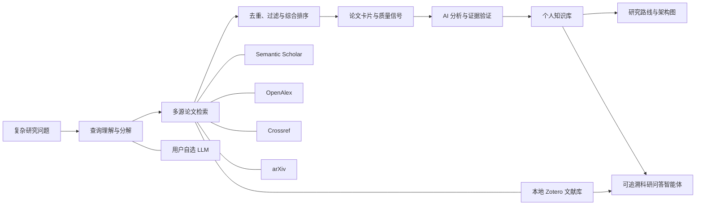

<p align="center">
  
</p>

<p align="center">
  <a href="README.md">English</a> · <strong>简体中文</strong>
</p>

<p align="center">
  <a href="https://github.com/zhangweiguo9719-web/ScholarNova/releases/latest"></a>
</p>

# ScholarNova：AI 学术论文检索与研究工作台

> 面向客户端的后续建设方案见：[AI 应用开发路线图](docs/AI_APPLICATION_ROADMAP.zh-CN.md)。文档说明模型替换、检索加速、长文 RAG、网络兜底、授权馆藏、文献管理器泛化与 MCP 的实施边界。
>
> 面向工程落地的流水线拆分见：[ScholarNova FTI 流水线架构](docs/FTI_PIPELINE_ARCHITECTURE.zh-CN.md)。

ScholarNova 面向复杂科研问题，将自然语言查询转化为检索计划，连接多个学术数据源和用户自己的 Zotero 文献库，对论文进行去重、排序、质量分析和证据整理，并将研究发现沉淀到个人知识库与研究路线中。

公开版采用 **BYOK（Bring Your Own Key）**：仓库不提供、不收集任何私人 API Key，也不包含授权评测数据。使用者可以自行选择模型、学术数据源和部署环境。

## Windows / macOS 桌面版（推荐普通用户）

无需手动安装 Python、Node.js、数据库，也不需要分别启动前后端；Windows 与 macOS 均为“一个应用，自带本地服务”。

### 直接下载 v1.2.0

**Windows**

- [Windows 安装版：`ScholarNova-Setup-1.2.0-x64.exe`](https://github.com/zhangweiguo9719-web/ScholarNova/releases/latest)
- [Windows 绿色版：`ScholarNova-Portable-1.2.0-x64.exe`](https://github.com/zhangweiguo9719-web/ScholarNova/releases/latest)

**macOS**（Intel 与 Apple Silicon）

- [macOS 磁盘映像：`ScholarNova-1.2.0-x64.dmg` / `ScholarNova-1.2.0-arm64.dmg`](https://github.com/zhangweiguo9719-web/ScholarNova/releases/latest)
- [macOS zip 压缩包：`.zip`](https://github.com/zhangweiguo9719-web/ScholarNova/releases/latest)
- [全部版本与更新说明](https://github.com/zhangweiguo9719-web/ScholarNova/releases/latest)

macOS 打开 `.dmg` 后把 ScholarNova 拖入“应用程序”文件夹即可。首次启动时若提示“来自互联网的下载”，请右键应用选择“打开”，再点一次“打开”。

### 三步开始使用

1. 下载并安装 Windows 安装版 / macOS `.dmg`，或者直接运行绿色版 `.exe`。
2. 启动 ScholarNova，在“设置”中填写自己的模型 API Key，点击“测试连接”通过后点“保存配置”。
3. 进入“搜索”页开始论文检索、全文 AI 分析、知识库保存与研究路线生成。

安装版与绿色版都会创建或更新 ScholarNova 桌面快捷方式。桌面版会自动启动内置服务，不需要再运行前端或后端命令；本地服务若意外退出会自动重启，避免“后端挂了”导致应用不可用。数据与配置保存在当前系统用户的 AppData（Windows）或 Application Support（macOS）目录中。安装包不包含维护者的 API Key、授权数据集或本地数据库。开发者自行构建说明见 [Windows 桌面版发布指南](docs/desktop-release.zh-CN.md)。

## 产品界面

| 学术检索首页 | 实时多源检索 |
| --- | --- |
|  |  |

| 个人研究知识库 | AI 研究路线与架构图 |
| --- | --- |
|  |  |

| AI 研究分析 | BYOK 模型配置 |
| --- | --- |
|  |  |

## 配置你自己的模型 API Key

ScholarNova 不捆绑任何厂商的 Key，你需要自带。全部配置都在“设置 → LLM 模型配置”：选择厂商、选择或填写模型名、粘贴 API Key、保留默认 API 地址，点击“测试连接”，通过后点“保存配置”。

> 你输入的 API Key 只保存在本机后端，不会回传给浏览器，也不会上传到任何地方。

### 内置厂商

| 厂商 | 如何申请 API Key | API 地址（已预填） | 推荐模型 |
| --- | --- | --- | --- |
| **OpenAI** | [platform.openai.com](https://platform.openai.com) → API keys | `https://api.openai.com/v1` | `gpt-4o`、`gpt-4o-mini` |
| **智谱（GLM）** | [open.bigmodel.cn](https://open.bigmodel.cn) → 个人中心 → API keys | `https://open.bigmodel.cn/api/paas/v4` | `glm-4-plus`、`glm-4.5-flash` |
| **硅基流动（SiliconFlow）** | [cloud.siliconflow.cn](https://cloud.siliconflow.cn) → API 密钥 | `https://api.siliconflow.cn/v1` | `Qwen/Qwen3-8B`、`Qwen/Qwen3-30B-A3B-Instruct-2507` |
| **商汤（SenseNova）** | [platform.sensenova.cn](https://platform.sensenova.cn) → 控制台 → API 密钥 | `https://token.sensenova.cn/v1` | `sensenova-u1-fast`（出图）、`sensenova-6.7-flash-lite` |
| **DeepSeek** | [platform.deepseek.com](https://platform.deepseek.com) → API keys | `https://api.deepseek.com/v1` | `deepseek-chat`、`deepseek-coder` |
| **Moonshot（Kimi）** | [platform.moonshot.cn](https://platform.moonshot.cn) → API keys | `https://api.moonshot.cn/v1` | `moonshot-v1-128k` |
| **小米 MiMo** | MiMo 智算 token 套餐控制台 | `https://token-plan-cn.xiaomimimo.com/v1` | `mimo-v2.5-pro` |
| **阿里云百炼（Qwen）** | [bailian.console.aliyun.com](https://bailian.console.aliyun.com) → API-KEY | `https://dashscope.aliyuncs.com/compatible-mode/v1` | `qwen-max`、`qwen-plus` |
| **Ollama（本机）** | 无需 Key——安装 [Ollama](https://ollama.com) 并拉取模型 | `http://localhost:11434` | `qwen2.5:14b`、`llama3:8b` |
| **自定义** | 任意 OpenAI 兼容端点 | 你自己的地址 | 你自己的模型 |

### 学生党低成本推荐配置

1. **主模型**——用**智谱（GLM）**：在 [open.bigmodel.cn](https://open.bigmodel.cn) 注册，新账号通常有免费额度，主模型选 `glm-4-plus`。
2. **读图 / 图表分析**——还是**智谱**：在“按任务类型配置不同模型 → 视觉”中把视觉任务配成多模态 GLM（如 `glm-4v-flash` / `glm-4.6v-flash`），论文图表页才能被真正读取。
3. **备用模型**——开启“备用文本模型”，选**硅基流动**的 `Qwen/Qwen3-8B`；只有主模型失败时才会调用一次，不会造成重复计费。
4. **研究架构图**——把“图表生成”任务模型配成**商汤** `sensenova-u1-fast` 来生成研究框架图。出图质量很大程度取决于前面提示词的质量。

### 按任务类型配置不同模型

不同任务对模型要求不同。打开“设置 → 按任务类型配置不同模型”，可为每个任务指定独立模型：

| 任务 | 用途 | 建议模型 |
| --- | --- | --- |
| 📊 论文分析 | 论文深度分析 | 智谱 `glm-4-plus` |
| 🔍 查询规划 | 自然语言 → 子查询 | 智谱 `glm-4-plus` |
| 🌐 翻译 | 摘要中英互译 | 任意文本模型 |
| 👁️ 图表/架构分析 | 论文图表与架构图 | 智谱 `glm-4v-flash` |
| 📄 论文推荐 | 基于知识库推荐论文 | 智谱 `glm-4-plus` |
| 🤖 科研问答智能体 | 可追溯 RAG 问答 | 智谱 `glm-4-plus` |
| 🎨 图表生成 | 研究架构图生成 | 商汤 `sensenova-u1-fast` |

每个任务行还会显示能力徽章（文本 / 视觉 / 出图 / JSON），并有“真实测试此任务”按钮：真实调用一次该模型，确认它确实能胜任该任务再放心使用。

### 可选：语义检索增强（Embedding）

打开“设置 → 语义检索增强”，用独立 Embedding 模型与 BM25 做 RRF 融合提升召回。不配置也能用，默认自动退回 BM25。

## 主要能力

- 复杂学术查询理解、约束识别、子查询分解与有界迭代检索。
- Semantic Scholar、OpenAlex、Crossref、arXiv 多源搜索。
- Semantic Scholar 搜索、健康检测和全文补全共用跨进程 1.25 秒节奏与 429 冷却；近期成功状态由本机快照复用，避免“检测数据源”反而继续消耗限额。
- 通过 Zotero Local API 连接本机文献库，显式导入后可与在线学术源一起检索；也可将你确认的论文通过 Zotero 本地 Connector 接口写回指定文件夹（与浏览器插件同一机制，Zotero 9 即可用）。
- 提供可追溯科研问答智能体：默认用零额外成本的中英文 BM25 排序知识库、已解析 PDF 与本机 Zotero；用户也可单独配置 Embedding 模型，启用 BM25 + 向量语义 + RRF 混合检索。
- 设置页会按任务检查已知模型能力，区分文本、结构化输出、视觉理解、图像生成和 Embedding；该检查不调用付费模型，无法识别的自定义模型会提示先测试，不会被误判为已支持。
- 每个任务模型还可由用户主动执行一次真实能力测试：结构化任务会解析 JSON，视觉任务会识别内置测试图，出图任务会在费用提示后生成测试图；最近一次耗时与供应商返回的输入/输出/总 Token 仅保存在本机，普通展开或保存配置不会调用模型。
- 标题、摘要、年份、venue、引用量和查询约束综合排序。
- 完整论文卡片：标题、作者、摘要、年份、来源、引用量、相关度和质量信号。
- 实时显示检索耗时、实际调用的 API、检索式、单源篇数与耗时；允许主动重复执行相同关键词。
- AI 分析会通过直链、arXiv、OpenAlex、Unpaywall、Semantic Scholar、Crossref 与 PMC 获取合法开放 PDF；若出版社阻止程序下载，可导入用户有权使用的本地 PDF，持久解析正文、章节、表格、图注及图表页面。
- 页面会明确区分“已读取全文”和“仅摘要”，并展示自动获取失败原因；不会把未取得的正文伪装成已读取。
- 图表页优先使用“设置 → 按任务配置不同模型 → 视觉”中的多模态模型；若该模型拒绝图片输入，系统会透明回退到正文、表格与图注，并如实显示未读取页面图像。
- 论文分析完成后会展示模型供应商返回的总 Token；API 响应同时提供输入和输出 Token。
- 论文详情侧栏支持向左拖动扩宽、键盘方向键调整，并记住上次宽度。
- 同一次检索中按论文临时保存 AI 分析，切换论文不会丢失，开始新检索时才清空。
- 搜索属于当前页面会话：离开搜索页即清除结果、关键词和临时分析，返回时不会恢复旧搜索；服务端仍可复用论文响应缓存以保护学术 API 配额。
- 引用百分位、年均引用、OpenAlex H-index/两年篇均被引/DOAJ；可导入自己有权使用的 JCR、历史中科院或 SJR CSV/JSON，系统不会伪造分区。
- 学校图书馆采用“复制检索词 + 打开门户”的合规衔接，仍需校园网、学校 VPN 或统一身份认证，不绕过订阅授权。
- 个人研究知识库、主题分类、研究路线与 SenseNova U1 框架图。
- 中英文切换、明暗主题、缓存、重试、限流和熔断。
- API 调用次数、端到端延时与真实 LLM Token 计量。

### Zotero 本地连接

1. 启动 Zotero，打开“设置 → 高级”，勾选“允许此计算机上的其他应用程序与 Zotero 通讯”。
2. 打开 ScholarNova 的“设置 → 连接 Zotero”，确认状态显示为“已连接”。
3. 选择一个 Zotero 文件夹或最近 50 篇顶层文献，点击“导入到 ScholarNova”。
4. 后续普通搜索会同时检索已导入的 Zotero 元数据，不产生额外网络请求。
5. 想把某篇论文写回 Zotero 时，在论文详情中点“同步到 Zotero”，再选择目标文件夹。ScholarNova 走的是 Zotero 本地 Connector 端点——与 Zotero 浏览器插件相同——Zotero 9 即可使用。

ScholarNova 不直接访问 `zotero.sqlite`，也绝不会上传整个文献库。导入会使用 Zotero Item Key 和 DOI 避免重复；附件 PDF 暂不自动复制，需要全文时可获取合法开放版本，或由用户手动导入自己有权使用的 PDF。ScholarNova 会显示检测到的 Zotero 版本以及本地访问是只读还是可写。

### 可追溯科研问答智能体

进入“智能体”页面后，可以为不同研究方向创建文件夹和独立对话。删除文件夹会把其中对话移到“未分类”，不会连带删除研究内容；记录仅保存在本机，并设置数量上限避免无限增长。每个对话可以选择使用 ScholarNova 本地材料和实时本机 Zotero。导入或分析过的授权 PDF 会把摘要、章节、表格和图注保存为版本化检索片段，并尽可能保留章节与页码。默认模式使用不消耗模型 Token 的中英文 BM25；在“设置 → 语义检索增强”中明确启用独立 Embedding 模型后，系统会对最多 256 个均衡候选执行向量排序，再通过 RRF 与 BM25 融合。向量按提供商、模型和内容哈希缓存在本机数据库，重复材料不会再次计费；Embedding 超时、限流、配置错误或服务离线时会自动退回 BM25，不影响基础问答。

本机优先方案是 Ollama + `nomic-embed-text`，无需云端 Key；也可以配置 OpenAI `text-embedding-3-small`、智谱 `embedding-3`、阿里云百炼 `text-embedding-v4` 或其他 OpenAI 兼容 Embedding 接口。Embedding Key 不继承聊天模型 Key，保存后前端只能看到“已配置”，不能读回明文。请先点击“测试语义模型”，确认向量维度后再保存。智能体页面会显示 `BM25` 或 `BM25 + Embedding RRF`，并将本次新产生的 Embedding Token 纳入总 Token；缓存命中不增加 Token。

无论采用哪种检索模式，系统都会限制单篇文档最多占两个证据位置，随后才要求回答模型使用 `[S1]` 形式逐条标注来源。引用卡片会显示章节、页码或知识片段号。如果没有找到相关本地材料，系统不会调用回答模型，而会提示先补充证据。对话记录仅保存在本机，智能体不会自动修改 Zotero。

回答生成后，系统会用不消耗额外 Token 的确定性校验器检查事实句引用覆盖率、来源编号是否存在以及是否出现未引用结论，并在智能体轨迹中显示“通过 / 部分覆盖 / 失败”。该检查验证的是引用完整性，不冒充语义蕴含判断。若回答模型超时或离线，系统不再直接中断，而会返回带 `[S1]` 编号的有界检索证据，明确标记为“模型离线 · 证据回退”，方便用户继续核验原文。

在“设置 → 备用文本模型”中还可以显式配置一个备用模型，例如将智谱或 MiMo 作为主模型、硅基流动 Qwen 或阿里云百炼 Qwen 作为备用。科研问答、AI 查询规划、标题/摘要翻译、论文正文分析、知识润色、研究方向分析、研究路线文字生成和推荐规划均已接入统一路由：正常请求只调用主模型；只有主模型经过有限重试仍失败后，系统才尝试一次备用模型。PDF 图表页仍只交给视觉任务模型，SenseNova 等出图服务仍走独立 diagram 配置，不参与文本降级链。论文与知识分析会记录实际模型、是否由备用模型接管以及供应商返回的 Token；两个文本模型都不可用时，系统返回基于现有摘要、正文或知识条目的规则结果。推荐入口在没有真实学术 API 元数据时只生成可核验检索方向，不编造论文题目或 DOI。不同供应商的 API Key 与地址相互隔离，留空不会误用另一家供应商的凭据。

### 分区数据与学校图书馆

在“设置 → 期刊分区与开放质量指标”中可导入自己有权使用的 CSV/JSON。最简 CSV 示例：

```csv
Journal,JCR Quartile,中科院分区,SJR Best Quartile,Year,Source
Nature Communications,Q1,1区,Q1,2025,本人有权使用的数据
```

没有数据就保持未知，不推测分区。OpenAlex H-index、两年篇均被引和 DOAJ 会明确标成开放指标，不作为 JCR/中科院分区。检索页“图书馆馆藏”会复制当前检索词并打开配置的门户；订阅资源仍需校园网、学校 VPN 或统一身份认证。

## 系统架构


```mermaid
flowchart LR
    U["复杂研究问题"] --> Q["查询理解与分解"]
    Q --> S["多源论文检索"]
    S --> D["去重、过滤与综合排序"]
    D --> R["论文卡片与质量信号"]
    R --> A["AI 分析与证据验证"]
    A --> K["个人知识库"]
    K --> G["研究路线与架构图"]
    K --> RA["可追溯科研问答智能体"]
    Z --> RA

    S --- SS["Semantic Scholar"]
    S --- OA["OpenAlex"]
    S --- CR["Crossref"]
    S --- AX["arXiv"]
    S --- Z["本地 Zotero 文献库"]
    Q --- LLM["用户自选 LLM"]
```

### 技术栈

| 层 | 技术与职责 |
| --- | --- |
| 桌面端 | Electron、electron-builder、PyInstaller 打包为自包含 Windows / macOS 应用 |
| 前端 | React 18、TypeScript、Vite、Zustand、React Router、Axios、Mermaid |
| 后端 | Python、FastAPI、Pydantic、AsyncIO、Uvicorn |
| 数据 | SQLAlchemy、本地 SQLite、服务端 PostgreSQL、Redis/内存缓存 |
| 检索 | Semantic Scholar、OpenAlex、Crossref、arXiv、Zotero Local API；查询规划、并发召回、去重、约束与 MMR 排序 |
| 文档与 AI | PyMuPDF 全文/图表解析，按任务路由的 OpenAI 兼容、Anthropic、Ollama、MiMo、硅基流动 Qwen 与商汤模型 |
| 工程 | pytest、Vitest、Ruff、GitHub Actions（Windows + macOS 发布流水线） |

## Docker Compose 源码部署（进阶）

需要 Git、Docker Engine 24+、Docker Compose v2 和至少 4 GB 空闲内存。

```bash
git clone https://github.com/zhangweiguo9719-web/ScholarNova.git
cd ScholarNova
cp .env.example .env
```

Windows PowerShell：

```powershell
git clone https://github.com/zhangweiguo9719-web/ScholarNova.git
Set-Location ScholarNova
Copy-Item .env.example .env
```

编辑 `.env`，配置至少一个 OpenAI 兼容 LLM：

```dotenv
OPENAI_API_KEY=your-key
OPENAI_API_BASE=https://api.openai.com/v1
OPENAI_DEFAULT_MODEL=gpt-4o
DEFAULT_LLM_PROVIDER=openai
```

推荐的学术数据源配置：

```dotenv
SEMANTIC_SCHOLAR_API_KEY=your-semantic-scholar-key
OPENALEX_API_KEY=your-openalex-key
OPENALEX_EMAIL=you@example.com
CROSSREF_EMAIL=you@example.com
```

可选：商汤研究架构图服务：

```dotenv
SENSENOVA_API_KEY=your-sensenova-key
SENSENOVA_API_BASE=https://token.sensenova.cn/v1
SENSENOVA_DEFAULT_MODEL=sensenova-u1-fast
```

对外部署前，请先替换 `.env` 中的 `POSTGRES_PASSWORD` 与 `SECRET_KEY`。

```bash
docker compose up -d --build
```

打开：

- Web UI：<http://localhost:5173>
- Swagger API：<http://localhost:8000/docs>
- 健康检查：<http://localhost:8000/api/v1/health>

常用运维：

```bash
docker compose ps
docker compose logs -f backend
docker compose down
```

## 无 Docker 源码开发（进阶）

本地模式使用 SQLite 和内存缓存，无需 PostgreSQL 与 Redis。

```bash
git clone https://github.com/zhangweiguo9719-web/ScholarNova.git
cd ScholarNova/backend
python -m venv .venv
```

激活环境并启动后端：

```bash
# Linux / macOS
source .venv/bin/activate

# Windows PowerShell
.\.venv\Scripts\Activate.ps1
```

```bash
python -m pip install --upgrade pip
pip install -e .
cp .env.example .env
uvicorn app.main:app --reload --host 127.0.0.1 --port 8000
```

Windows 使用 `Copy-Item .env.example .env`。启动前编辑 `backend/.env`，数据库表在首次启动时自动创建。

另开一个终端：

```bash
cd ScholarNova/frontend
npm ci
npm run dev
```

打开 <http://localhost:5173>。

## 厂商配置环境变量

| 用途 | 变量 | 要求 |
| --- | --- | --- |
| 默认 LLM | `OPENAI_API_KEY` | 至少配置一个 LLM |
| 兼容端点 | `OPENAI_API_BASE` | 兼容厂商必填 |
| 默认模型 | `OPENAI_DEFAULT_MODEL` | 必填 |
| Semantic Scholar | `SEMANTIC_SCHOLAR_API_KEY` | 推荐；未认证限额更严 |
| OpenAlex API | `OPENALEX_API_KEY` | 推荐 |
| OpenAlex polite pool | `OPENALEX_EMAIL` | 推荐 |
| Crossref polite pool | `CROSSREF_EMAIL` | 推荐 |
| 商汤出图 | `SENSENOVA_API_KEY` | 可选 |

模型配置也可在设置页完成；服务端部署建议优先使用 `.env`，这样配置在容器重建后仍然保留。

各厂商官方注册入口与详细配置见 [API Key 申请指南](docs/API_KEYS.md)。

## 评估快照

面向官方 Asta Paper Finder 验证集的可复现 18 题确定性子集用于定向回归测试：

| 指标 | 之前 | 现在 |
| --- | ---: | ---: |
| Precision | 0.259434 | **0.352313** |
| Recall | 0.367893 | 0.331104 |
| F1 | 0.304288 | **0.341379** |
| Recall@20 | 0.160535 | **0.163880** |

这是可复现的 **18 题验证子集**，不是完整比赛成绩；不得与不同数据集或评估协议的结果直接对比。确定性查询规划有意消耗 0 LLM Token；模型辅助的产品查询会如实上报供应商用量。

完整 66 题文件也已运行。其中 27 题含二元论文 ID 金标，F1=`0.283713`；其余 39 题需要文本相关性判定，单独报告，不强行纳入二元指标。

详见 [基准评测报告](outputs/competition-benchmark-report-2026-07-02.md)、[v1.1.0 优化测试报告](docs/reports/v1.1.0-optimization-test-report.zh-CN.md)、[v1.1.1 全文、视觉与桌面版测试报告](docs/reports/v1.1.1-fulltext-vision-desktop-report.zh-CN.md)、[FTI-4 会话与速率治理报告](docs/reports/fti-4-session-and-rate-governance.zh-CN.md) 与已提交的 [预测产物](outputs/benchmarks/predictions/asta-s2-validation18-v3-2026-07-02.json)。

## 验证

```bash
cd backend
pytest -m "not integration"

cd ../frontend
npm test
npm run build
```

## 安全

- 不要提交 `.env`、API Key、模型配置文件、授权数据集或运行日志。
- 若 Key 曾泄露，请到厂商处撤销并重新生成。
- JCR / 中科院分区仅在拥有授权数据源时展示，ScholarNova 不会伪造。
- 对外部署前请阅读 [SECURITY.md](SECURITY.md)。

## 参与贡献

欢迎提交 Issue 与 Pull Request。提交前请阅读 [CONTRIBUTING.md](CONTRIBUTING.md)。

## License

[MIT](LICENSE) © 2026 Zhang Weiguo.
