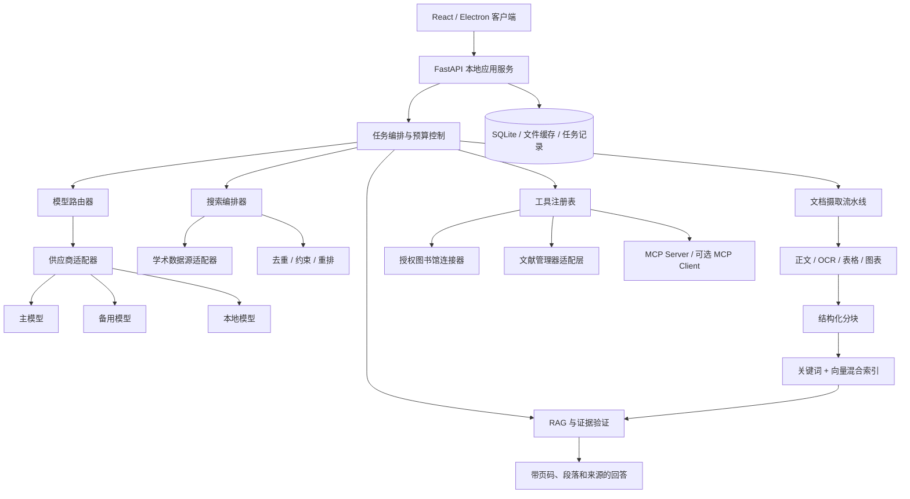

# ScholarNova 面向客户端的 AI 应用开发路线图

> 状态：产品化规划文档
>
> 更新日期：2026-09-01
>
> 目标：把 ScholarNova 从“可用的科研检索产品”继续建设为可替换模型、可验证回答、可扩展工具、可诊断网络问题的桌面科研工作台。

## 1. 产品方向

ScholarNova 不应把“大模型调用次数多”当成智能化，而应把 AI 放在最能产生价值的位置：

1. 理解复杂问题并生成有边界的检索计划。
2. 帮助多个学术数据源更快、更准地召回候选论文。
3. 从用户有权访问的全文中提取可定位、可复核的证据。
4. 在知识库和证据约束下完成问答、比较和研究路线规划。
5. 通过明确授权连接图书馆、文献管理器和其他科研工具。

核心原则是：**确定性程序负责连接、检索、权限、缓存和记录；AI 负责理解、重排、归纳和解释；所有重要结论必须回到证据。**

## 2. 当前系统已经具备什么

| 能力 | 当前实现 | 下一步缺口 |
| --- | --- | --- |
| 桌面应用 | Electron + React + 本地 FastAPI 服务 | 自动更新、迁移与诊断中心仍需加强 |
| 模型接入 | `LLMGateway` 统一调用多家 OpenAI-compatible、Anthropic、Ollama 等模型，并支持按任务配置 | 缺少统一的模型能力描述、自动降级和主备路由 |
| 学术检索 | 查询规划、多源并发、去重、约束验证、MMR 排序、缓存、限流和断路保护 | 需要“快速/深度”两种预算模式与渐进式返回 |
| PDF 分析 | 合法开放全文获取、本地 PDF 导入、正文/章节/表格/图注/图表页解析；文本结构已进入版本化 `paper_chunks` 与统一 BM25 检索，章节、表格和图注保留可用页码 | 需要图像区域级证据、可选向量召回和长文分层归纳 |
| 知识库 | SQL 数据库存储研究材料；智能体使用统一片段契约与中英文 BM25 联合检索知识库、PDF、实时 Zotero 后再生成回答，并返回结构化证据位置 | 尚未加入可选向量召回和 PDF 图像区域级证据，因此还不是完整的混合向量 RAG |
| Zotero | 本地检测、文件夹读取、元数据导入和只读搜索 | Zotero 10+ 授权写入、附件传递和通用文献管理适配层尚未完成 |
| 学校图书馆 | 复制检索词并跳转门户，保留校园网/VPN/统一身份认证 | 尚未建立“用户登录后授权”的受控浏览器连接器 |
| 智能体 | 有来源编号、工具轨迹、模型与 Token 记录的问答 MVP | 需要工具权限、任务状态、证据校验和可恢复执行 |

## 3. 四个容易混淆的概念

### 3.1 FastAPI 是什么

FastAPI 是 ScholarNova 本地后端使用的 Python Web 框架。它负责：

- 接收前端请求，例如搜索、分析、配置和智能体问答。
- 校验请求和响应数据。
- 调用检索器、模型网关、数据库和外部 API。
- 提供超时、限流、错误码和接口文档。

**换一个模型 API Key 后功能尽量不受影响，并不是 FastAPI 自动带来的能力。**真正起作用的是：

1. 统一模型网关与供应商适配器。
2. 稳定的内部请求/响应数据结构。
3. 按任务选择模型的路由器。
4. 模型能力检测、连接测试和失败降级。
5. 后端安全保存 Key，前端不读取明文。

FastAPI 是承载这些能力的后端框架，不等于模型抽象层本身。

### 3.2 RAG 是什么

RAG（检索增强生成）是“先检索材料，再让模型依据材料回答”。当前科研智能体已经是一个**轻量级、可追溯 RAG 雏形**：

```text
用户问题
  → 检索 ScholarNova 知识库和本机 Zotero
  → 选择少量相关材料
  → 交给模型生成带 [S1] 来源编号的回答
```

但当前还不是成熟 RAG。知识库和 Zotero 已完成统一 BM25 稀疏检索，仍缺：

- PDF 章节级分块与稳定 Chunk ID。
- BM25 + 向量语义的混合召回（BM25 已完成，向量召回待接入）。
- 元数据过滤和专用重排器。
- 结论到原文页码、段落、图表的逐条映射。
- 回答后的证据充分性检查与拒答阈值。

### 3.3 MCP 是什么

MCP 是让 AI 客户端以标准方式发现和调用工具的协议。它适合解决“不同 AI 或科研软件如何调用 ScholarNova 能力”，但不是所有内部功能都必须改成 MCP。

建议：

- ScholarNova 内部核心链路继续使用直接 Python 调用和 HTTP API，简单、稳定、易测试。
- 将“搜索论文、读取知识库、保存文献、查询 Zotero 文件夹”等能力整理成统一 Tool Registry。
- 后续把这套工具选择性暴露为 ScholarNova MCP Server，供其他支持 MCP 的客户端调用。
- 若外部科研工具已经提供可靠 MCP Server，可作为可选连接器接入。

不要为了使用 MCP 而让核心搜索绕远路。MCP 的价值是**标准化跨应用工具边界**，不是替代所有 API。

### 3.4 Agent 是什么

Agent 不等于一个聊天框。可靠 Agent 至少需要：

- 明确目标和执行预算。
- 可用工具列表及参数约束。
- 每一步的权限和用户确认。
- 可观察的执行轨迹。
- 超时、重试、取消、恢复和部分结果。
- 基于证据的最终输出。

## 4. 目标架构



## 5. 从首页到设置的产品路径

### 5.1 首页：先判断“能不能开始”

目标不是继续增加宣传文字，而是提供清晰入口：

- “快速搜索”和“深度研究”两个主要模式。
- 首次使用检查：模型是否可用、至少一个学术源是否可用、存储目录是否正常。
- 无 Key 时仍允许使用不依赖 LLM 的基础关键词搜索。
- 显示最近任务、知识库和连接器状态，但不在首页暴露复杂参数。

### 5.2 搜索页：AI 加速而不是阻塞

建议拆成两条路径：

**快速搜索**

- 立即用原始查询并发访问可用数据源。
- AI 查询规划设置严格短超时；超时直接回退到规则关键词。
- 数据源完成一个就显示一个，允许用户取消剩余慢源。
- 使用缓存、DOI/标题去重和确定性初排。

**深度研究**

- AI 分解约束和子问题。
- 有边界地执行查询扩展、引文追踪和二次检索。
- 每一轮有时间、API 次数和 Token 上限。
- 达到覆盖率目标、无新增高质量论文或预算耗尽时停止。

兜底顺序：

```text
AI 查询规划失败
  → 规则提取关键词/年份/来源
  → 原始查询多源检索
  → 确定性排序
  → 仍然返回已有结果并说明降级原因
```

### 5.3 论文详情与分析：长文不能一次塞给模型

推荐流水线：

1. 获取用户有权访问的 PDF，并保存来源、许可入口和文件哈希。
2. 解析章节、段落、页码、表格、图注与图片页面。
3. 按章节和语义边界分块，每块保留 `paper_id/page/section/chunk_id`。
4. 根据具体分析问题只召回相关块，而不是把全文全部发给模型。
5. 对超长论文执行 Map-Reduce：分块提取 → 章节摘要 → 全文综合。
6. 要求每个关键结论引用对应 Chunk；没有证据时输出“无法确认”。
7. 将部分完成结果持续写入任务记录，超时后仍能显示已完成章节。

响应时间兜底：

- 每一阶段独立超时，禁止一次请求无限等待。
- 支持取消和断点恢复。
- 先返回元数据/摘要结果，全文分析作为后台任务继续。
- 视觉模型不可用时，降级到正文、表格文本和图注，并明确标注没有读取图片。
- 主模型失败时，可切备用模型；都失败则返回抽取证据而不是空页面。

降低幻觉的关键不是把提示词写得更严厉，而是减少无关上下文、保留原文定位、验证结论是否被证据支持。

### 5.4 知识库：升级为真正的科研 RAG

建议引入以下实体：

- `Document`：论文或用户文档及其版本、哈希和访问来源。
- `Chunk`：页码、章节、文本、表格或图注片段。
- `Embedding`：与具体嵌入模型版本绑定的向量。
- `Evidence`：结论与一个或多个 Chunk 的映射。
- `Collection`：用户项目或研究主题。
- `IngestionRun`：解析、OCR、索引状态和失败原因。

检索采用“关键词召回 + 向量召回 + 元数据过滤 + 重排”，并把最终引用精确定位到页码和段落。只有通过证据阈值的回答才标记为“基于本地材料”；否则应拒答或提示需要补充文献。

### 5.5 智能体：从问答 MVP 到受控科研助手

- 页面展示计划、正在调用的工具、已消耗预算和可取消状态。
- 读取数据可以默认授权；下载、写入 Zotero、删除或上传必须逐次确认。
- 每个任务保存可恢复状态，不依赖一个超长 HTTP 请求。
- 工具输出使用稳定 JSON 数据结构，模型只负责选择工具和归纳。
- 最终答案必须列出引用、材料覆盖范围和仍不确定的内容。

### 5.6 设置：从“填写 Key”升级为“能力与连接中心”

建议分为五组：

1. **模型配置**：供应商、模型、Key、Base URL、能力检测、主备模型。
2. **任务路由**：查询规划、翻译、分析、视觉、智能体分别选择模型。
3. **网络配置**：直连/系统代理/校园代理、每个目标的诊断、`localhost` 强制绕过代理。
4. **连接器**：Zotero、其他文献管理器、图书馆授权连接。
5. **数据与隐私**：缓存目录、容量、保留时间、导出、清除和诊断日志。

## 6. 模型可替换而不影响功能

在现有 `LLMGateway` 基础上增加 `ModelCapability`：

```text
text_generation
json_schema
vision
tool_calling
streaming
context_window
max_output_tokens
embedding
```

保存新 Key 时执行：

1. 检查 Base URL 安全性。
2. 测试鉴权和最小文本响应。
3. 检测 JSON、视觉、工具调用等任务能力。
4. 只有测试通过才原子替换旧配置；失败时保留旧配置。
5. 每个任务路由只选择满足能力要求的模型。
6. 配置主模型、备用模型和不使用 AI 的确定性兜底。

需要避免把供应商专有字段扩散到业务代码。供应商差异只应该存在于适配器内部。

## 7. 网络、科学上网和校园网

它们确实会影响模型 API、学术 API 和学校订阅资源，但影响方式不同：

- 全局代理可能让海外模型/API 可访问，也可能让国内模型变慢或失败。
- 校园 VPN 用于校内资源身份，不等同于 HTTP(S) 代理。
- Zotero 本地接口是 `127.0.0.1`，必须绕过系统代理；当前代码已经使用 `trust_env=False`。
- 不同数据源可能需要不同网络路径，不能用一个开关覆盖全部连接。

目标设计是“按目标路由”的网络配置：

- 国内模型：默认直连。
- 海外模型/学术源：可选择系统代理。
- 学校订阅资源：校园网或学校 VPN。
- 本地服务：始终 `NO_PROXY=127.0.0.1,localhost`。

设置页应显示 DNS、TLS、HTTP 状态、耗时、是否被限流和实际使用的网络配置，但不能记录 Key、Cookie 或密码。

## 8. 图书馆授权检索与下载

可以做，但必须按“用户主动登录和授权”设计，不能让 Agent 获取或保存用户密码，也不能绕过验证码、付费墙或许可限制。

推荐三阶段：

### 阶段 A：安全跳转（当前能力）

- 复制查询词并打开馆藏门户。
- 用户自行完成校园网/VPN/统一身份认证。

### 阶段 B：受控浏览器连接器

- 由用户在系统浏览器中登录。
- 用户明确授权当前任务使用已登录会话。
- Agent 只执行允许域名内的搜索、打开和下载操作。
- 遇到验证码、许可确认、跨域跳转或下载前必须暂停并让用户操作。
- 不读取、不导出、不持久化密码和通用 Cookie。

### 阶段 C：合规缓存与分析

- 下载前显示来源、文件名、大小和保存目的。
- 记录“用户授权下载”的审计事件。
- PDF 仅保存在本机可配置缓存中，支持过期清理。
- 后续分析和写入文献管理器均由用户选择。

不要一开始就做“适配所有学校网站的自动登录 Agent”。学校门户结构、认证协议和许可差异巨大，应先支持白名单域名与明确流程，再逐步扩展。

## 9. 文献管理工具的泛化

Zotero 不应成为业务数据结构。应定义通用 `ReferenceManagerAdapter`：

```text
detect()
capabilities()
list_collections()
search_items(query)
add_item(metadata, collection)
attach_file(item_id, local_file)
export_items(format)
```

连接器根据能力声明只读或可写。建议顺序：

1. Zotero 本地 API：已有只读基础，后续支持 Zotero 10+ 用户授权写入。
2. 通用 BibTeX/RIS/CSL-JSON 导出：覆盖 JabRef、EndNote 等大量工具，成本最低。
3. 明确有稳定官方 API 的文献管理器。
4. 最后才考虑依赖浏览器自动化或插件的工具。

用户保存论文时应先选择目标连接器和文件夹，并预览将写入的元数据与附件；写入失败不能影响 ScholarNova 本地保存。

## 10. MCP 应该放在哪里

适合：

- 对外提供 `search_papers`、`get_paper_evidence`、`search_knowledge`、`list_collections` 等只读工具。
- 在用户授权后提供 `save_to_reference_manager` 等写操作。
- 连接已存在且可信的外部科研 MCP 服务。

不适合：

- 替代内部高频、低延迟的 Python 函数调用。
- 让模型绕过 FastAPI 直接访问数据库、文件系统或任意网页。
- 在没有权限确认和审计的情况下执行下载、上传、删除或写入。

MCP 工具需要：参数 Schema、超时、域名/路径白名单、读写权限、用户确认、调用日志和结果大小限制。

## 11. 分阶段实施路线

### P0：模型与网络底座

- 增加模型能力描述和主备路由。
- 新配置测试通过后再替换旧配置。
- 增加按目标网络诊断和本地地址强制绕过代理。

验收：换一家文本模型后，搜索仍可运行；不支持视觉的模型不会被分配视觉任务；模型全部不可用时基础检索仍有结果。

### P1：搜索效率与渐进结果

- 增加快速/深度模式和统一预算对象。
- 查询规划短超时与规则回退。
- 数据源渐进返回、取消、缓存命中和失败原因展示。

验收：快速模式首批结果有明确时间目标；单源 429/超时不阻塞其他源；重复查询优先命中缓存。

### P2：文档摄取与混合 RAG

> 实施状态：已完成知识条目与 PDF 结构分块、内容哈希、特征版本、统一检索片段契约、知识库/PDF/Zotero 的中英文 BM25 联合排序，以及章节/页码级引用展示；详见 [FTI 流水线架构](FTI_PIPELINE_ARCHITECTURE.zh-CN.md)。

- 建立 Document/Chunk/IngestionRun。
- 为 PDF 图像区域补充可引用定位，再引入可选向量召回与混合重排。
- 长文分层分析、证据映射、部分结果和恢复。

验收：每个重要结论可定位到论文、页码和原文片段；超大 PDF 不再整篇塞入上下文；无证据问题拒答。

### P3：授权馆藏与通用文献管理器

- 建立 Connector 与 ReferenceManagerAdapter。
- 完成 Zotero 10+ 授权写入和通用 BibTeX/RIS 导出。
- 设计白名单、用户在场的图书馆浏览器连接器。

验收：不保存密码；任何下载/写入均可预览、确认和审计；连接器失败不丢失本地成果。

### P4：Agent 工作流与 MCP

- 工具注册表、任务状态机、权限确认和可恢复执行。
- 暴露只读 ScholarNova MCP Server，再逐步开放写工具。
- 建立 Agent 轨迹和成本面板。

验收：用户可以看到 Agent 为什么调用工具；危险操作无法静默执行；中断后可恢复任务。

### P5：客户端产品化

- 自动更新、数据库迁移、崩溃恢复和本地诊断包。
- 缓存容量、隐私、数据导出和清除策略。
- 匿名且可关闭的性能指标；默认不上传论文正文、Key 或检索历史。

## 12. 统一验收指标

| 维度 | 建议指标 |
| --- | --- |
| 检索质量 | Precision、Recall、F1、nDCG、来源覆盖率 |
| 检索效率 | 首批结果时间、完整结果时间、API 次数、缓存命中率 |
| 分析质量 | 有引用结论比例、引用正确率、无证据拒答率 |
| 稳定性 | 单源失败可用率、超时率、恢复成功率、崩溃率 |
| 成本 | 每次搜索/分析 Token、模型费用、重复调用节省量 |
| 连接器 | 授权成功率、下载成功率、写入成功率、重复文献率 |
| 隐私安全 | 未确认写操作数应为 0，明文 Key 暴露数应为 0 |

## 13. 必须避开的坑

1. 不把整篇 PDF 直接塞进一个提示词。
2. 不让模型生成 DOI、分区、实验结果等事实后直接入库。
3. 不把模型供应商字段写进核心 Paper/Knowledge 数据结构。
4. 不因为 AI 失败就让基础搜索不可用。
5. 不让全局代理接管 `localhost` 和 Zotero 本地连接。
6. 不保存图书馆密码，不自动绕过验证码和授权条款。
7. 不把浏览器自动化当作稳定 API；它只能是有用户在场的受控连接器。
8. 不允许 Agent 静默下载、上传、删除或写入外部工具。
9. 不只展示“成功/失败”，要记录阶段、耗时、来源和降级原因。
10. 不以“接入了 MCP/RAG/Agent”作为完成标准，要以用户任务和验收指标为准。

## 14. 开发者学习与代码阅读顺序

1. `frontend/src/pages/`：理解首页、搜索、知识库、智能体和设置的用户流程。
2. `frontend/src/api/client.ts`：理解前端如何调用本地 API。
3. `backend/app/main.py` 与 `backend/app/api/v1/router.py`：理解 FastAPI 如何组织接口。
4. `backend/app/api/v1/model_config.py`：理解 Key 保存、连接测试和任务配置。
5. `backend/app/services/llm/gateway.py`：理解模型供应商抽象。
6. `backend/app/services/search/orchestrator.py`：理解完整搜索流水线。
7. `backend/app/services/search/retriever.py`：理解并发、超时、单源降级和断路保护。
8. `backend/app/services/sources/`：理解数据源适配器。
9. `backend/app/services/pdf/` 与 `backend/app/services/evidence/`：理解全文与证据。
10. `backend/app/api/v1/agent.py`：理解当前轻量 RAG 智能体。
11. `backend/app/services/integrations/zotero.py`：理解本地连接器和代理隔离。

建议先掌握 Python `async/await`、FastAPI/Pydantic、HTTP/API、SQLAlchemy 和 React 状态流，再学习向量检索、RAG 评测和 Agent 工具协议。开发者不需要手写所有代码，但必须能解释数据从哪里来、经过哪些步骤、失败如何降级、结果如何验证。

## 15. 下一步优先级

下一轮最值得先做的是 **P0 模型能力与主备路由**，随后做 **P1 快速/深度搜索模式**。这两项能直接回答“换 Key 会不会坏”“AI 是否真的加快搜索”“网络或模型失败时能否继续用”，也是后续 RAG、图书馆连接器和 MCP 的可靠底座。
