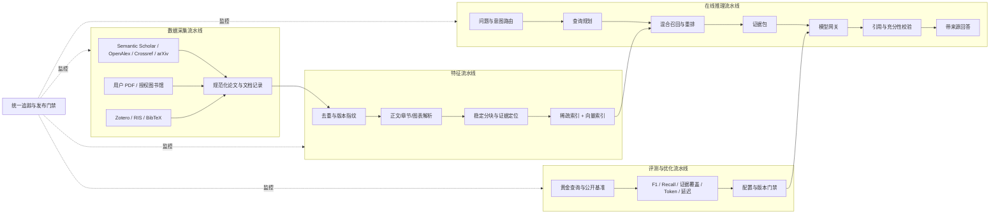

# ScholarNova 的 FTI 流水线架构

> 参考：Decoding AI 的 [LLM Twin Course](https://github.com/decodingai-magazine/llm-twin-course)
>
> 状态：渐进实施中；本文同时记录现状、目标边界和验收标准。

## 1. 名称与适配原则

LLM Twin 使用的是 **FTI（Feature、Training、Inference）**，不是 FIT。它还在 FTI 前面设置数据采集与 CDC，并用评测、监控和模型注册表形成发布门禁。

ScholarNova 不直接复制其“社交内容采集 + 微调个人写作模型”业务，而采用下面的科研适配：

1. **Collection / Data Pipeline**：采集论文元数据、合法全文、用户知识条目和授权文献管理器记录。
2. **Feature Pipeline**：规范化、去重、正文解析、分块、证据定位、稀疏/向量特征和索引。
3. **Evaluation & Optimization Pipeline**：使用公开基准、黄金问题集和回归样本评估检索、RAG、成本和延迟。现阶段不强制微调模型。
4. **Inference Pipeline**：意图识别、查询规划、多源检索、混合召回、重排、证据打包、模型生成和回答校验。
5. **Observability & Release Gate**：记录数据版本、提示词、模型、Token、延迟、错误和证据覆盖，控制版本发布。

核心约束：**先做模块边界和数据契约，暂不拆成多个网络微服务。** 桌面产品继续保持 Electron + React + 本地 FastAPI 的模块化单体，等确有独立扩缩容需求时再拆服务。

## 2. 当前项目映射

| 流水线 | 当前代码 | 已有能力 | 主要缺口 |
| --- | --- | --- | --- |
| 数据采集 | `services/sources`、`services/search/retriever.py`、`services/pdf`、`services/integrations/zotero.py` | 多学术 API、并发检索、PDF 获取解析、Zotero 读取 | 统一文档契约、授权馆藏连接器、增量同步 |
| 特征 | `deduplicator.py`、`constraint_verifier.py`、`evidence`、`knowledge_chunks`、`paper_chunks`、`services/retrieval` | 去重、约束验证、证据跨度、知识/PDF 分块、中英文 BM25、统一检索片段契约 | 可选向量索引、图像区域级 Chunk |
| 评测优化 | `services/evaluation/benchmark.py`、`tests/evaluation` | F1/Precision/Recall、基准适配、离线回归 | RAG 黄金集、按流水线版本对比、发布阈值 |
| 推理 | `orchestrator.py`、`ranker.py`、`llm/gateway.py`、`services/inference`、`api/v1/agent.py` | 查询规划、多源召回、混合排序、证据打包、统一模型网关、引用完整性校验与模型离线证据回退 | 可选主备模型路由、语义蕴含校验、阶段耗时持久化 |
| 监控门禁 | `SearchRun`、质量快照、Token 记录、GitHub Actions | 搜索耗时/API 次数、模型用量、305 项离线测试 | 统一 Trace ID、阶段耗时、线上质量抽样与数据漂移 |

## 3. 目标数据流

## 4. 四类稳定数据契约

### 4.1 DocumentRecord

统一表示 API 论文、PDF、知识条目和文献管理器记录，至少包含：

- `document_id`：内部稳定 ID。
- `source` / `source_id`：来源与来源侧 ID。
- `title`、`authors`、`doi`、`year`、`venue`。
- `content_uri`、许可/访问方式与获取时间。
- `content_hash`、解析器版本和更新时间。

### 4.2 FeatureChunk

统一表示可检索的正文、知识和图表片段，至少包含：

- `chunk_id`、`document_id`、`position`。
- `content`、`content_hash`、`feature_version`。
- 章节、页码、图表编号和字符/Token 数。
- 稀疏特征、向量模型版本和索引状态。

### 4.3 EvaluationRun

记录数据集版本、检索配置、模型、提示词、指标、成本、延迟和失败原因，保证“成绩变化能解释、能复现”。

### 4.4 InferenceTrace

记录一次用户请求经过的意图路由、查询规划、数据源、候选集、重排、证据片段、模型调用、Token 和最终校验结果。隐私内容默认保存在本机。

## 5. 已落地：知识特征流水线与统一稀疏检索

本轮新增 `knowledge_chunks` 特征表和 `services/features/knowledge.py`：

1. 按段落/句子边界将长知识内容切成约 1200 字符的重叠片段。
2. 为每个片段生成由知识 ID、内容哈希、位置和特征版本决定的稳定 ID。
3. 新建、更新、删除知识条目时同步构建或清理特征。
4. 历史知识条目在第一次检索时自动补建，无需用户迁移数据。
5. 智能体检索相关片段而不是截取整条内容；同一知识条目最多占两个片段。
6. 无相关特征命中时明确返回材料不足，不回退到任意最近记录。

FTI-2A 在此基础上新增：

1. 用供应商无关的 `RetrievalChunk` 契约统一知识库和实时 Zotero 候选材料。
2. 采用不依赖外部模型的中英文 BM25，对标题、元数据和正文片段统一计分。
3. 两类来源进入同一候选池后再排序，不再各自固定占用上下文名额。
4. 每篇文档最多保留两个片段，防止一篇长文挤占全部证据位置。
5. 无相关命中时停止在检索层，不调用 LLM，因此该阶段不会新增模型 Token 成本。

FTI-2B 继续把 PDF 接入同一条流水线：

1. 新增 `paper_chunks` 特征表，保存解析器生成的摘要、章节、表格与图注片段。
2. 每个片段保留论文 ID、内容哈希、特征版本、类型、章节标题和可用页码。
3. 用户导入 PDF 时立即建立特征；后续执行全文分析时会确定性校验并同步特征。
4. 科研问答将 PDF、知识库和 Zotero 放入同一 BM25 候选池，而不是把完整长文一次塞给模型。
5. PDF 特征生成失败不会破坏原有上传和摘要分析流程，错误只影响全文检索增强。

FTI-2C 增加可核验定位：

1. PDF 解析器在章节中保留起止页，并逐页提取图注，因此不再丢失图表所在页。
2. `paper_chunks` v2 将章节、表格、图注和无结构全文片段关联到可用页码。
3. 科研问答引用返回结构化 `section`、`page`、`chunk_index`，而不是拼接好的展示字符串。
4. 前端按中英文模式显示“章节 · 第 N 页”或“Section · p. N”，便于用户返回原文核验。
5. 当前只宣称文本、表格与图注级定位；尚未宣称能够定位 PDF 图片内部的视觉区域。

FTI-2D 增加可选混合语义检索：

1. Embedding 配置与聊天模型配置分离，只有用户明确启用后才调用向量接口。
2. 支持 Ollama 本地协议与 OpenAI-compatible `/embeddings`，并提供连接测试。
3. 候选向量按提供商、模型和标准化输入哈希缓存在 `retrieval_embeddings`，避免重复计费。
4. 稀疏与向量排名通过 RRF 融合，不直接混合不可比较的 BM25 分数和余弦分数。
5. 向量服务超时、限流、配置错误或离线时自动退回 BM25，基础问答保持可用。
6. 每次回答分别记录 Embedding Token 和回答模型 Token；缓存命中不增加向量 Token。
7. 四条中英文、跨语言和长文主题黄金回归样本中，混合检索 Top-1 为 4/4，BM25 为 3/4。该结果只用于算法回归，不是 PaSa/AstaBench 竞赛成绩。

FTI-3A 建立可恢复推理基线：

1. 智能体轨迹明确显示 `retrieve → evidence_pack → answer_generation → answer_verification`。
2. 回答后用确定性规则检查事实句引用覆盖、无效来源编号和未引用事实句，不增加一次模型调用。
3. 校验结果分为 `verified / partial / failed`，前端显示覆盖率和问题数量，不再只凭“检索到材料”就宣称回答已充分落地。
4. 回答模型超时、配置错误或离线时，返回有界的原始检索证据与合法来源编号，而不是让整个请求返回 502。
5. 当前校验只保证引用完整性，不宣称证据在语义上必然支持结论；语义蕴含与冲突检查仍属于后续能力。

FTI-3B 建立显式模型主备路由：

1. 设置页提供独立的备用文本模型配置，可直接使用 Qwen、智谱、MiMo、DeepSeek、Ollama 或其他已有适配器；当前产品入口先接入科研问答。
2. 正常请求只调用主模型；主模型有限重试失败后才调用一次备用模型，不做常态双调用。
3. 路由契约预留问答、分析、查询规划、翻译和推荐等文本任务，并明确排除视觉分析与出图；本阶段只把问答标为已完成集成。
4. 每次尝试分别记录角色、供应商、模型、状态、请求次数和供应商返回的 Token，最终结果显示实际接管模型。
5. 不同供应商的 Key、Base URL 和模型名相互隔离；任务级或备用配置不会继承另一家供应商的凭据。
6. 主备均不可用时继续使用 FTI-3A 的确定性证据回退，保持请求可恢复。

FTI-3C 将路由扩展为可检查、可复用的文本任务底座：

1. 新增保守的模型能力注册表，区分文本、结构化输出、视觉理解、图像生成和 Embedding；未知自定义接口返回“待测试”，不冒充已兼容。
2. 设置页展开任务配置时从本机后端读取能力报告，不产生供应商 API 调用或 Token，并明确提示匹配、不匹配或未知。
3. 查询规划通过兼容旧 `.chat()` 契约的路由适配器接入主备模型；每条路线限制为 5.5 秒，使备用模型可在 12 秒总预算内接管，两个模型均失败后规则规划仍兜底。
4. 标题/摘要翻译接入同一主备路由，并在 API 响应中返回实际提供商、模型、主备状态和供应商 Token。
5. 视觉分析、SenseNova 出图、长文分析和知识推荐暂不混入文本路由，防止能力错误分配；后两者属于下一步迁移范围。
6. 调试模式下仅对 localhost 放行 HTTP，使本机 Ollama 可用；外部 HTTP 和内网访问限制保持不变。

## 6. 分阶段优化顺序

### FTI-1：特征基线（本轮）

- 知识分块、内容哈希、特征版本、懒回填。
- 智能体片段级检索与来源多样性。
- 验收：确定性测试通过；旧数据无损；无关问题不引用随机材料。

### FTI-2：统一文档与混合检索（2A/2B/2C/2D 已完成）

- 已为知识库与 Zotero 建立统一 `RetrievalChunk`，并完成中英文 BM25 联合排序。
- 已将 PDF 的摘要、章节、表格与图注接入相同契约，并用 `paper_chunks` 持久化版本化特征。
- 已保留章节起始页、表格页和图注页，并将结构化位置返回到引用卡片。
- 已加入独立可选 Embedding、本地向量缓存、RRF 融合、Token 记录和 BM25 自动降级。
- 下一步补齐通用 DocumentRecord、PDF 图像区域证据、缓存清理策略和真实产品查询集评测。
- 验收：固定黄金集 Recall@K、MRR、证据命中率不低于基线，延迟与磁盘增长可解释。

### FTI-3：推理管线与模型主备（3A/3B/3C 已完成）

- 明确 `intent → plan → retrieve → rerank → evidence → generate → verify` 阶段。
- 已完成证据打包、生成、引用完整性校验的可观察轨迹，以及模型离线确定性证据回退。
- 已实现显式备用文本模型、供应商凭据隔离、有限故障切换和逐次 Token 轨迹。
- 已加入零调用能力检查，并将科研问答、查询规划和翻译接入统一主备路由。
- 下一步迁移长文分析与知识推荐，增加真实能力探针、工具调用能力和语义蕴含校验。
- 验收：每一步可观察；任何单个外部服务失败不导致整个搜索不可用。

### FTI-4：评测与发布门禁

- 将 PaSa/AstaBench 子集、产品回归问题和长文证据问题分开管理。
- 同时报 F1、Recall、证据覆盖、Token、首结果延迟、总延迟和失败率。
- 离线回归与真实联网健康检查分开；429 属于外部健康事件，不伪装成代码回归。
- 验收：每个版本自动生成可比较报告，未达到阈值不得发布。

### FTI-5：受控连接器与 MCP

- 图书馆和文献管理器通过统一 Connector/Tool 接口接入。
- 用户登录、授权范围、下载许可与写入操作显式确认。
- 将稳定工具选择性暴露为 MCP Server，核心内部调用不强制 MCP 化。
- 验收：最小权限、可撤销授权、完整操作记录和安全域名白名单。

## 7. 开发规则

1. 每个新功能必须声明属于哪条流水线、输入输出契约和失败兜底。
2. 不让 React 页面直接理解供应商 API；统一通过 FastAPI 与模型/连接器适配层。
3. 不把完整长文一次塞给 LLM；必须先检索相关片段，再分层归纳。
4. 不把 LLM-as-judge 当唯一指标；检索与引用使用确定性指标验证。
5. 不把真实联网测试混入普通回归门禁。
6. 没有黄金集和基线数据之前，不进行昂贵微调。
7. 所有 Key、登录态和个人文献默认只保存在用户本机，不进入日志和公共仓库。
